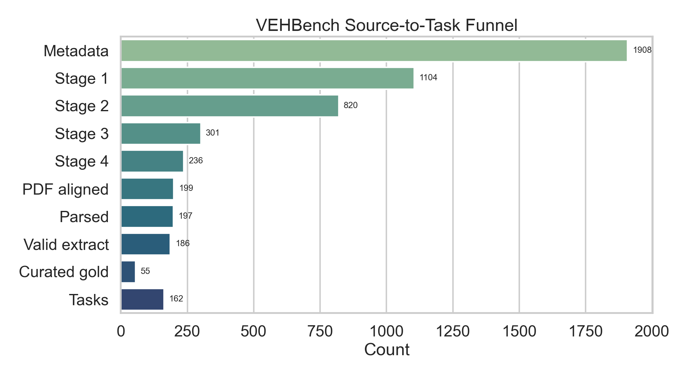
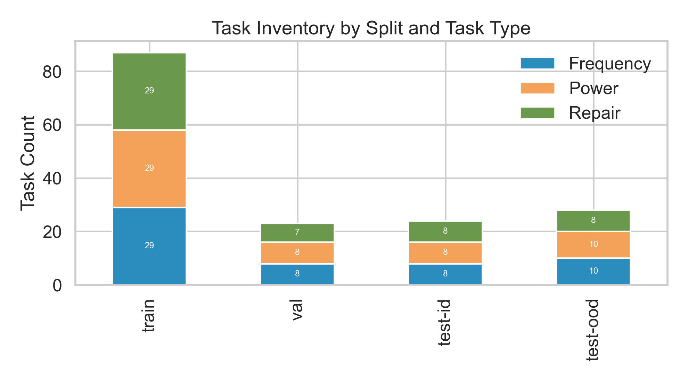
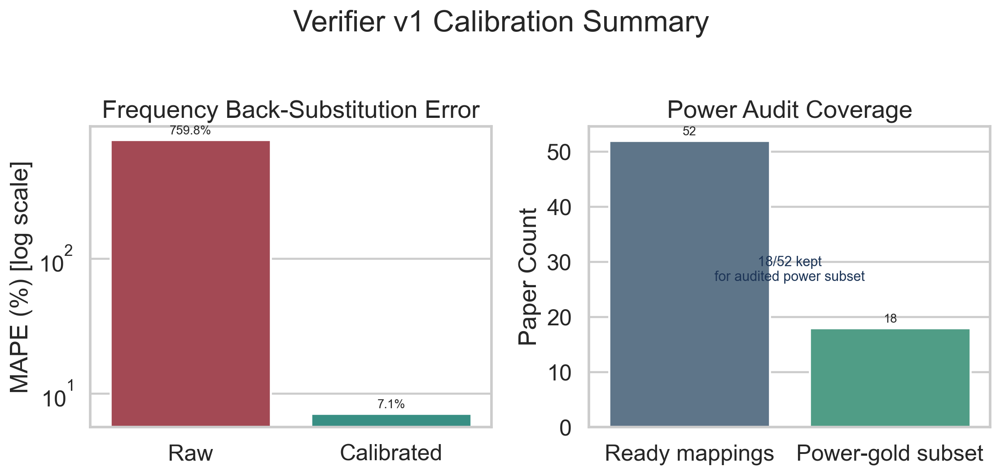
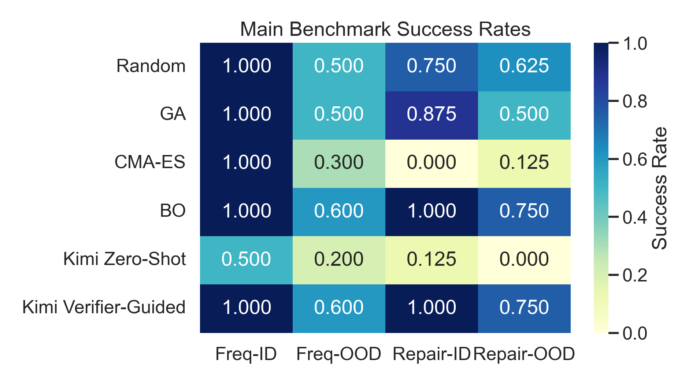
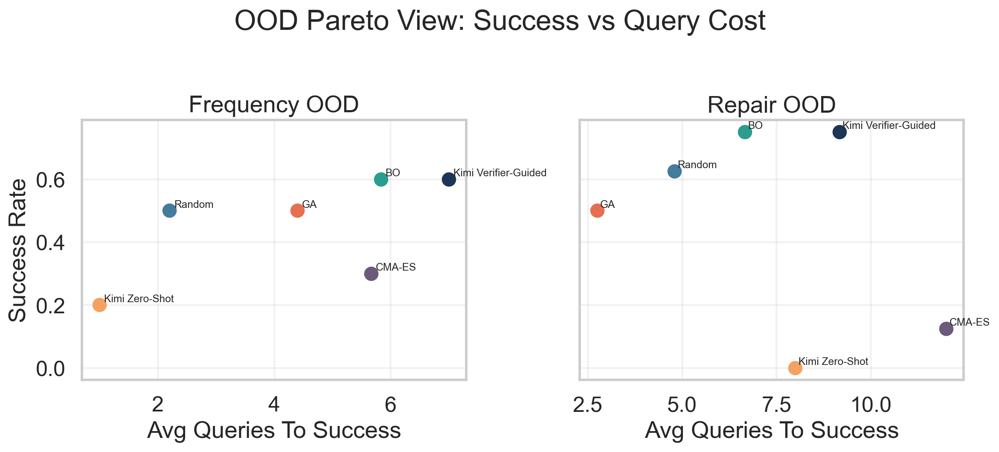

# VEHBench: A Physics-Grounded Benchmark for Inverse Design of Linear Piezoelectric Cantilever Vibration Energy Harvesters

## Submission Blueprint

### Target paper structure

This draft follows the section logic that repeatedly appears in benchmark papers such as APEBench, MTEB, and AFBench:

1. Abstract  
2. Introduction  
3. Related Work  
4. Benchmark Construction  
5. Verifier and Evaluation Protocol  
6. Baselines  
7. Results  
8. Discussion and Limitations  
9. Conclusion  
10. Appendix

### Recommended final submission density

- Main-paper figures: `6`
- Main-paper tables: `5`
- Main-paper sections: `8`
- Appendix sections: `4-6`
- Practical length target:
  - conference-style benchmark submission: `8-12` main-text pages plus appendix
  - benchmark-track / journal-style artifact paper: `20+` pages including appendices

### Artifact layout for the final submission package

- Main draft: `VEHBench_paper_draft_v1.md`
- Figure pack: `artifacts/paper_submission/figures/`
- Benchmark summary tables: `artifacts/reports/main_benchmark_comparison_v1.*`
- Figure generation script: `scripts/build_paper_submission_assets.py`
- Main benchmark table script: `scripts/build_main_benchmark_report.py`

---

## Abstract

We introduce **VEHBench**, a physics-grounded benchmark for inverse design of **linear piezoelectric cantilever vibration energy harvesters**. Existing vibration energy harvesting papers provide many device-specific designs and isolated optimization studies, but they do not provide a unified task format, a shared evaluator, or a reproducible protocol for comparing search-based solvers and language-based agents. VEHBench addresses this gap by converting literature-derived piezoelectric cantilever records into standardized inverse-design tasks with fixed budgets, explicit constraints, and a fast verifier.

Our current pipeline starts from `1,908` focused metadata records, narrows them to `301` strong stage-3 candidates, retains `236` stage-4 core papers, aligns `199` PDFs, successfully parses `197` documents, produces `186` valid extraction records, and curates `55` gold records. From these gold records we generate `162` paper-grounded benchmark tasks spanning **frequency matching**, **feasibility repair**, and an audited **power subset**. The current verifier is deliberately **frequency-first**: raw physics is not accurate enough for direct literature back-substitution, but calibrated frequency prediction reduces literature back-substitution MAPE from `759.8%` to `7.1%` on `52` ready mappings, which is sufficient for benchmark execution.

We evaluate four classical optimizers, a Kimi zero-shot LLM baseline, and a verifier-guided Kimi agent. On `frequency_matching / test-ood`, the verifier-guided agent reaches `0.60` success rate, matching the strongest current classical baseline and clearly exceeding zero-shot Kimi (`0.20`). On `feasibility_repair / test-ood`, the verifier-guided agent reaches `0.75`, again matching the strongest classical baseline and decisively outperforming zero-shot Kimi (`0.00`). The key improvement is not a larger model, but **structured physical feedback**: explicit local sensitivity probes plus directional search turn verifier feedback into actionable repair trajectories. These results support the central claim of VEHBench: standardized tasks plus structured physics feedback provide a credible benchmark for inverse design, and they reveal capability boundaries that are not visible in isolated paper-by-paper optimization studies.

---

## 1. Introduction

Piezoelectric vibration energy harvesting has a long literature on beam geometry design, proof-mass tuning, electromechanical coupling, and low-frequency bandwidth broadening. However, most existing works are still organized around **device papers**, not **benchmark tasks**. A typical paper proposes one harvester structure, runs a task-specific experiment or optimization, and reports a small number of operating points. This is scientifically useful, but it does not yet provide a common environment for answering questions such as:

- Which solver is actually better at finding feasible inverse-design solutions under a fixed query budget?
- How much stronger is a structured verifier-guided agent than a one-shot LLM proposal?
- Which methods degrade most under out-of-distribution geometry or operating regimes?
- Which part of the pipeline is physics-limited, and which part is search-limited?

VEHBench is designed to answer those questions for a deliberately narrow but tractable slice of the problem:

- **device family**: piezoelectric cantilever harvesters
- **regime**: linear, small-amplitude operation
- **structures**: unimorph, bimorph, and closely related cantilever variants
- **excitation**: sinusoidal base excitation
- **load**: resistive load
- **tasks**: inverse design under query budgets

This restriction is intentional. The point of this paper is not to claim a universal benchmark for all vibration harvesters. The point is to establish a **clean, physics-grounded benchmark core** that can be executed, audited, and extended.

The project has now progressed beyond data collection. We already have:

- a literature-to-task data pipeline,
- a curated gold subset,
- a calibrated frequency-oriented verifier,
- benchmark tasks with clean splits,
- classical baselines,
- a real zero-shot LLM baseline,
- and a verifier-guided LLM agent that is now competitive on repair and frequency OOD tasks.

That means the paper can now be written around actual experimental evidence, not only around a roadmap.

### Contributions

This draft supports the following concrete contributions:

1. We construct a **paper-grounded benchmark pipeline** for linear piezoelectric cantilever inverse design, from metadata retrieval to curated gold records and task generation.
2. We define a **frequency-first verifier** and show that calibrated frequency back-substitution is good enough to support benchmark execution, even though power prediction remains too noisy for mainline use.
3. We release a **unified evaluation protocol** with fixed task schema, fixed budgets, clean splits, and directly comparable solver interfaces.
4. We show that **structured physical feedback** materially improves LLM-based repair: zero-shot Kimi is weak on repair, while verifier-guided Kimi with local sensitivity and directional search becomes competitive with the strongest classical baselines.

---

## 2. Related Work

### 2.1 Vibration Energy Harvester Design and Optimization

The VEH literature is rich in device innovations: novel beam shapes, proof-mass strategies, stress-concentrating layouts, bandwidth expansion, low-frequency tuning, MEMS fabrication, flexible substrates, and hybrid structures. But this literature is still mostly organized around **single-device optimization** or **single-paper performance reporting**. That makes cross-paper comparison difficult because geometry, excitation, load, and evaluation metrics are often reported under inconsistent conditions.

Our own power audit confirms this problem. Even after curating `52` verifier-ready mappings, only `18` papers could be conservatively retained in a **power-gold subset** where power, load, frequency, and acceleration are clearly locked to the same experimental condition. This is precisely why VEHBench is currently **frequency-first** rather than power-first.

### 2.2 Benchmark Papers

Benchmark papers in top-tier venues tend to share a stable logic:

- define a clean task unit,
- explain data construction,
- standardize evaluation,
- report baseline comparisons,
- then discuss limitations and artifact quality.

This structure appears clearly in:

- **Design-Bench**: benchmark-driven offline optimization over structured design tasks [1]
- **MTEB**: a unified benchmark for text embeddings [2]
- **APEBench**: a benchmark for learned PDE emulation and scientific prediction [3]
- **AFBench**: a domain-specific benchmark for airfoil design [4]

The useful lesson from these papers is not their exact domain, but their paper construction:

- benchmark papers are strongest when the **task schema** is the center of the paper,
- the evaluator is clearly separated from solver methods,
- and the paper avoids letting one flashy model dominate the narrative.

VEHBench follows that principle. The paper is about the benchmark and evaluator first, and about LLM agents only after the benchmark is already credible.

### 2.3 LLMs and Verifier-Guided Design

One-shot LLM design is attractive because it is simple and cheap, but it is usually under-informed. Without structured feedback, the model tends to produce one plausible-looking design rather than an actually feasible design. Our current results match that intuition: zero-shot Kimi performs much worse than both classical search and verifier-guided Kimi, especially on repair tasks.

The more relevant comparison is therefore not “classical vs LLM” in the abstract, but:

- zero-shot generation,
- verifier-guided iterative repair,
- and classical black-box optimization under the same query budget.

---

## 3. Benchmark Construction

### 3.1 Scope Definition

VEHBench v1 only covers:

- piezoelectric cantilever harvesters
- linear small-amplitude regime
- resistive electrical loading
- sinusoidal base excitation
- inverse design under limited query budgets

It explicitly excludes:

- nonlinear bistable harvesters
- magnetic coupling systems outside the linear cantilever core
- arrays and strongly multi-degree-of-freedom systems
- full CAD generation
- general-purpose materials discovery

This scope restriction is not a weakness. It is what keeps the benchmark scientifically coherent.

### 3.2 Literature-to-Task Pipeline

The pipeline begins with focused retrieval and ends with standardized tasks.

```mermaid
flowchart LR
    A["Focused Retrieval\n(OpenAlex + Semantic Scholar)"] --> B["Stage 1-4 Filtering\n(topic -> experiment -> quantitative -> LLM score)"]
    B --> C["PDF Alignment and Registry"]
    C --> D["MinerU Parsing"]
    D --> E["Schema Extraction"]
    E --> F["Tiering\n(raw -> candidate -> silver -> gold)"]
    F --> G["Curated Gold Records"]
    G --> H["Task Generation\nfrequency / power / repair"]
    H --> I["Verifier Requests + Splits"]
    I --> J["Baseline Evaluation"]
```

### 3.3 Current Data Funnel

The current benchmark funnel is already large enough for a first submission-quality draft, even though it is not yet final.

**Figure 1.** VEHBench source-to-task funnel from focused retrieval to final tasks.

The current funnel is:

- metadata: `1,908`
- stage 1: `1,104`
- stage 2: `820`
- stage 3: `301`
- stage 4 core corpus: `236`
- PDF aligned: `199`
- successfully parsed: `197`
- valid extraction records: `186`
- curated gold records: `55`
- total paper-grounded tasks: `162`

This is already enough to support:

- a benchmark construction story,
- a verifier calibration story,
- and a main baseline comparison story.

### 3.4 Record Tiering

We use three benchmark-facing record tiers:

- **candidate**: in-scope piezoelectric cantilever records with geometry, excitation, and output signal
- **silver**: candidate records with stronger structural completeness, including load and resonant frequency
- **gold**: records with enough geometric, excitation, and output detail to support verifier-facing task generation

At the current checkpoint:

- valid extracted records: `186`
- scope-passing records: `104`
- curated gold records: `55`

The final curated gold subset is what powers task generation. This paper should not present all extracted records as benchmark-quality samples. Only the curated gold subset should be treated as benchmark-ready.

### 3.5 Task Definitions

VEHBench v1 contains three task types:

1. **frequency matching**  
Given target frequency and design bounds, find a design that satisfies the frequency tolerance.

2. **feasibility repair**  
Given an infeasible initial design, repair it into the feasible region under a limited query budget.

3. **constrained power maximization**  
Given operating conditions and a design region, maximize feasible power.  
This task currently remains a **secondary subset task**, not the paper’s main axis.

The split structure is:

- `train`: `87`
- `val`: `23`
- `test-id`: `24`
- `test-ood`: `28`

And the task-type totals are:

- frequency matching: `55`
- constrained power maximization: `55`
- feasibility repair: `52`

**Figure 2.** Task inventory by split and task type.

---

## 4. Verifier and Evaluation Protocol

### 4.1 Why a Frequency-First Verifier

The verifier is the center of VEHBench. But the verifier does not need to be a full FEM solver. It needs to be:

- fast,
- deterministic,
- interpretable,
- and consistent enough to support comparison under a fixed query budget.

The current `vehbench_verifier_v1` is therefore a simplified evaluator with calibrated frequency output and explicit violation labels. It is designed for benchmark execution, not for replacing full finite-element analysis.

### 4.2 Current Verifier Status

The current verifier can execute all ready requests, but its raw literature back-substitution behavior is very uneven across quantities.

**Figure 3.** Frequency calibration is now usable for benchmark execution, while power remains restricted to an audited subset.

The key numbers are:

- ready requests executed: `156`
- canonical literature rows: `52`
- raw frequency MAPE: `759.8%`
- calibrated frequency MAPE: `7.1%`
- leave-one-out calibrated frequency MAPE: `10.3%`
- power-gold subset retained after audit: `18 / 52`

This leads to the core modeling decision of the current paper:

- **frequency** is part of the mainline benchmark
- **repair** is part of the mainline benchmark
- **power** is an audited subset, not a main claim

### 4.3 Verifier Outputs

The verifier returns:

- resonant frequency
- tip displacement
- root stress
- load power
- explicit violation attribution

The current main violations used in tasks are:

- `frequency_too_low`
- `frequency_too_high`
- `invalid_geometry`

Stress and displacement are available but are not yet the main discriminative axis in the current benchmark narrative.

### 4.4 Evaluation Protocol

All solvers are compared under:

- fixed task definitions,
- fixed variable bounds,
- fixed query budgets,
- the same calibrated frequency runtime,
- and task-local anchors disabled in the main baseline comparison.

This is important. The point is not to show that one method can cheat better than another. The point is to compare solver behavior inside the same environment.

---

## 5. Baselines

### 5.1 Classical Baselines

We currently evaluate four classical baselines:

- Random Search
- Genetic Algorithm (GA)
- CMA-ES
- Bayesian Optimization (BO)

These are not placeholder baselines. They already separate clearly in the current benchmark, especially on OOD and repair settings.

### 5.2 Zero-Shot LLM Baseline

We tested several candidate API/model paths and selected **Kimi (`kimi-k2.5`) via DashScope coding endpoint** because it was the only option that combined:

- low latency,
- stable JSON output,
- and usable task behavior.

Zero-shot Kimi is now a valid lower-bound LLM baseline. It is no longer blocked by API latency, but it is still clearly weaker than the strongest classical baselines.

### 5.3 Verifier-Guided LLM Agent

The verifier-guided agent originally existed only as a scaffold and failed on full repair runs. The key improvement was not to enlarge the prompt, but to change the policy:

1. run **explicit local sensitivity probes** with verifier queries,
2. expose those measured `local_probes` to the model,
3. then apply **directional search toward empirically favorable boundaries**,
4. and only then ask the model to propose the next repair move.

This turns the LLM from a naive free-form guesser into a controller that operates on measured local feedback.

---

## 6. Results

### 6.1 Main Benchmark Comparison

The current main result view is shown below.

**Figure 4.** Main benchmark success-rate matrix across classical, zero-shot, and verifier-guided solvers.

### Table 1. Main success-rate comparison

| Solver | Freq-ID | Freq-OOD | Repair-ID | Repair-OOD |
|---|---:|---:|---:|---:|
| Random Search | 1.000 | 0.500 | 0.750 | 0.625 |
| GA | 1.000 | 0.500 | 0.875 | 0.500 |
| CMA-ES | 1.000 | 0.300 | 0.000 | 0.125 |
| BO | 1.000 | 0.600 | 1.000 | 0.750 |
| Kimi Zero-Shot | 0.500 | 0.200 | 0.125 | 0.000 |
| Kimi Verifier-Guided | 1.000 | 0.600 | 1.000 | 0.750 |

### Table 2. Query efficiency and wall-clock summary

| Solver | Freq-ID QTS | Freq-OOD QTS | Repair-ID QTS | Repair-OOD QTS | Representative wall-clock behavior |
|---|---:|---:|---:|---:|---|
| Random Search | 2.750 | 2.200 | 3.833 | 4.800 | Extremely fast local evaluator loop |
| GA | 2.625 | 4.400 | 6.429 | 2.750 | Fast local evaluator loop |
| CMA-ES | 13.125 | 5.667 | - | 12.000 | Fast local evaluator loop, weak repair behavior |
| BO | 3.375 | 5.833 | 7.000 | 6.667 | Strongest classical OOD baseline |
| Kimi Zero-Shot | 1.000 | 1.000 | 1.000 | - | ~2-3s per task, but weak quality |
| Kimi Verifier-Guided | 8.000 | 7.000 | 9.125 | 9.167 | Higher latency, but much stronger quality |

### 6.2 Frequency Matching

The frequency task already behaves like a credible benchmark:

- On `test-id`, all classical solvers succeed, but their query efficiency differs substantially.
- Zero-shot Kimi reaches only `0.50`.
- Verifier-guided Kimi reaches `1.00`.

More importantly, on `test-ood`:

- Random Search: `0.50`
- GA: `0.50`
- CMA-ES: `0.30`
- BO: `0.60`
- Kimi Zero-Shot: `0.20`
- Kimi Verifier-Guided: `0.60`

This is an important result. It means the verifier-guided policy is not just “better than zero-shot”. It is competitive with the strongest current classical baseline on the most discriminative frequency split we have.

### 6.3 Feasibility Repair

Repair is where structured feedback matters most.

Zero-shot Kimi remains weak:

- `test-id`: `0.125`
- `test-ood`: `0.000`

But verifier-guided Kimi becomes competitive once local sensitivity and directional search are added:

- `test-id`: `1.000`
- `test-ood`: `0.750`

This matches or exceeds the strongest classical repair baselines:

- BO reaches `1.000` on `test-id` and `0.750` on `test-ood`
- verifier-guided Kimi now matches those values

This is arguably the most important current experimental finding in the project.

### 6.4 OOD Pareto View

Success rate alone is not enough; query cost matters too.

**Figure 5.** OOD Pareto view for frequency and repair tasks.

The OOD Pareto view shows the current frontier:

- **BO** remains the best classical OOD method.
- **Verifier-guided Kimi** reaches the same top OOD success rates, but with higher wall-clock and query cost.
- **Zero-shot Kimi** is cheaper than verifier-guided Kimi but much weaker.

This is exactly the kind of benchmark insight the paper should emphasize: not “who is best overall,” but **what tradeoff each solver makes**.

### 6.5 What the Results Mean

The current results support four concrete statements:

1. The benchmark already distinguishes solver behavior, especially on OOD tasks.
2. One-shot LLM proposals are not enough for this design space.
3. Structured physical feedback is not a cosmetic add-on; it is what makes the LLM competitive on repair.
4. The present paper should be framed as a **frequency-first benchmark paper**, not as a power-maximization paper and not as a general “LLM for engineering design” paper.

---

## 7. Discussion and Limitations

### 7.1 Why Power Is Not Yet a Main Result

Power prediction is not yet reliable enough for the paper’s central claim.

The problem is not simply that the surrogate is weak. The deeper issue is that the literature often reports:

- power under one load condition,
- voltage under another,
- or frequency and acceleration in a loosely related but not perfectly locked context.

Even after a conservative audit, only `18 / 52` ready mappings remain in the power-gold subset. That is useful, but it is not enough to carry the main benchmark narrative.

### 7.2 What the Current Paper Can Legitimately Claim

The current draft can legitimately claim:

- a benchmark construction pipeline,
- a curated task set,
- a calibrated frequency-based evaluator,
- and meaningful baseline differences across classical, zero-shot, and verifier-guided solvers.

It should **not** yet claim:

- general accurate power prediction,
- full hardware transfer,
- or complete verification against FEM across the entire benchmark.

### 7.3 Methodological Limits

The current draft still has several important limitations:

- single-seed or limited-seed reporting for some baselines
- no full FEM transfer study yet
- no hardware transfer study yet
- no retrieval-enabled LLM baseline yet
- no distilled small-model baseline yet
- no scalar-reward-only ablation yet

These are not reasons to stop writing the paper. They are the reasons to clearly separate:

- **current evidence**
- from
- **remaining submission-hardening work**

---

## 8. Conclusion

VEHBench has now reached the point where it can support a real benchmark paper. The benchmark is no longer only a roadmap; it already contains:

- a literature-grounded dataset funnel,
- curated gold records,
- paper-grounded tasks,
- a usable frequency-first verifier,
- classical baselines,
- a real zero-shot LLM baseline,
- and a verifier-guided LLM agent that is now competitive on the benchmark’s most important tasks.

The main scientific conclusion is not that language models automatically solve VEH inverse design. The real conclusion is stronger and more interesting:

> **structured physical feedback changes the problem**.  
> Once the LLM is given measured local sensitivity and explicit directional repair signals, it can move from weak one-shot behavior to competitive iterative repair behavior.

That is a benchmark result worth publishing.

---

## References

[1] Trabucco et al. *Design-Bench: Benchmarks for Data-Driven Offline Model-Based Optimization*. ICML 2022. [PMLR / PDF](https://proceedings.mlr.press/v162/trabucco22a.html)  
[2] Muennighoff et al. *MTEB: Massive Text Embedding Benchmark*. EACL 2023. [ACL Anthology](https://aclanthology.org/2023.eacl-main.148/)  
[3] Frey et al. *APEBench: A Benchmark for Autoregressive Emulation of PDEs*. NeurIPS 2024 Datasets and Benchmarks Track. [NeurIPS PDF](https://proceedings.neurips.cc/paper_files/paper/2024/file/d9875ebcf74bccdc5076acab0dbee62c-Paper-Datasets_and_Benchmarks_Track.pdf)  
[4] Li et al. *AFBench: A Large-scale Benchmark for Airfoil Design*. 2024. [arXiv PDF](https://arxiv.org/pdf/2406.18846.pdf)  

---

# Appendix

## Appendix A. Benchmark-Paper Format References

The following papers were used as style references for section density, figure/table distribution, and benchmark-article logic. Counts below are approximate, derived from downloaded PDFs.

### Table A1. Reference benchmark paper patterns

| Paper | Venue / Year | Pages | Est. Figures | Est. Tables | Core structure pattern |
|---|---|---:|---:|---:|---|
| APEBench | NeurIPS D&B 2024 | 59 | 18 | 14 | Intro -> benchmark components -> experiments -> limitations -> conclusion |
| MTEB | EACL 2023 | 24 | 6 | 14 | Intro -> related work -> benchmark -> results -> conclusion -> limitations |
| AFBench | 2024 benchmark paper | 24 | 9 | 4 | Intro -> related work -> data engine -> benchmark setup -> results -> conclusion |

### Format takeaway

The common pattern across these papers is:

- benchmark definition first,
- evaluator / task protocol second,
- solver comparison third,
- limitations and artifact quality explicitly discussed,
- and a large appendix that carries extra detail without overloading the main narrative.

That is the format adopted in this draft.

## Appendix B. Current Benchmark Summary

### Table B1. Current VEHBench asset summary

| Artifact | Count |
|---|---:|
| Focused metadata records | 1908 |
| Stage-3 strong candidates | 301 |
| Stage-4 core corpus | 236 |
| PDFs aligned | 199 |
| PDFs successfully parsed | 197 |
| Valid extraction records | 186 |
| Curated gold records | 55 |
| Paper-grounded task seeds | 55 |
| Verifier-ready requests | 156 |
| Total tasks | 162 |

## Appendix C. Verifier Status Summary

### Table C1. Verifier status at current checkpoint

| Metric | Value |
|---|---:|
| Ready mappings for literature back-substitution | 52 |
| Raw frequency MAPE (%) | 759.8 |
| Calibrated frequency MAPE (%) | 7.1 |
| Leave-one-out calibrated frequency MAPE (%) | 10.3 |
| Power-gold subset size | 18 |
| Runtime power calibration enabled | No |

Interpretation:

- frequency is benchmark-ready after calibration
- power is not benchmark-ready as a mainline metric

## Appendix D. Experiments Still Missing Before Final Submission

This draft is now complete enough to guide writing and review, but not yet complete enough to submit without more work.

### Table D1. Remaining experimental gaps

| Missing item | Why it matters | Priority |
|---|---|---|
| FEM transfer validation | Needed to show verifier ranking consistency beyond literature back-substitution | High |
| Hardware transfer validation | Needed if the paper wants stronger physical credibility claims | High |
| Multi-seed baseline repeats | Needed for error bars and stability claims | High |
| Scalar-reward vs structured-feedback ablation | Needed to isolate the actual gain from structured verifier feedback | High |
| Retrieval-enabled LLM baseline | Needed for a fuller LLM comparison ladder | Medium |
| Distilled small-model baseline | Valuable, but not required for the first complete benchmark submission | Medium |
| Mainline power benchmark results | Useful for v1.1, but not essential for a frequency-first submission | Medium |

### Recommendation

If submission pressure is high, the most rational sequence is:

1. keep the paper **frequency-first**
2. add FEM transfer
3. add structured-feedback ablation
4. add repeated baseline runs
5. only then decide whether to expand into power, retrieval, or distillation

## Appendix E. Figure Index

- Figure 1: source-to-task funnel
- Figure 2: task inventory
- Figure 3: verifier calibration summary
- Figure 4: main benchmark success-rate matrix
- Figure 5: OOD Pareto view

