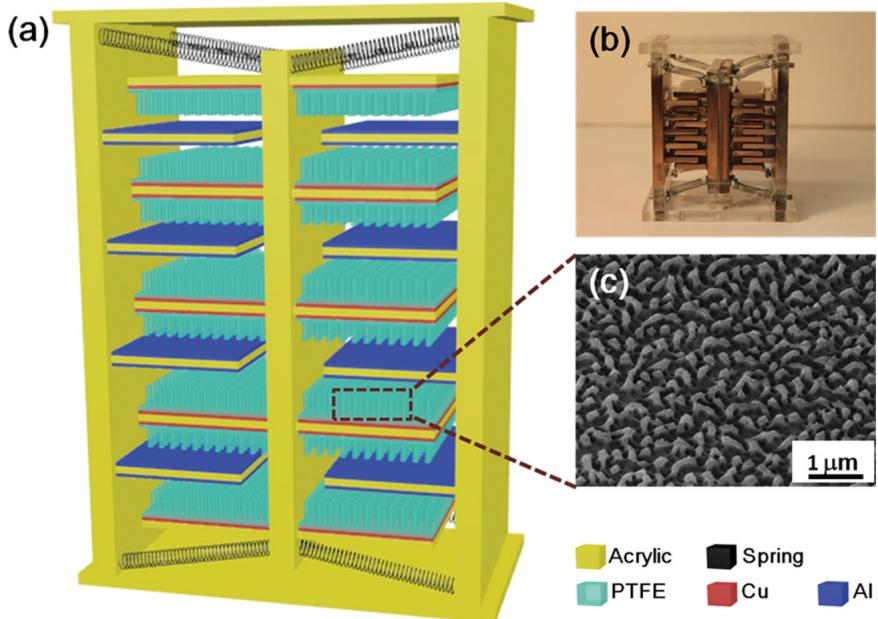
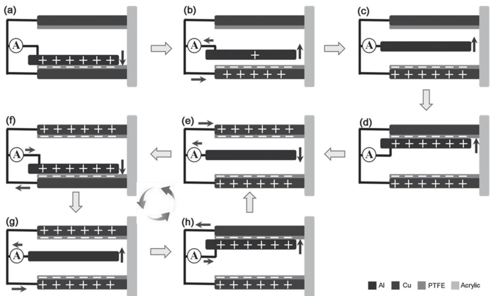
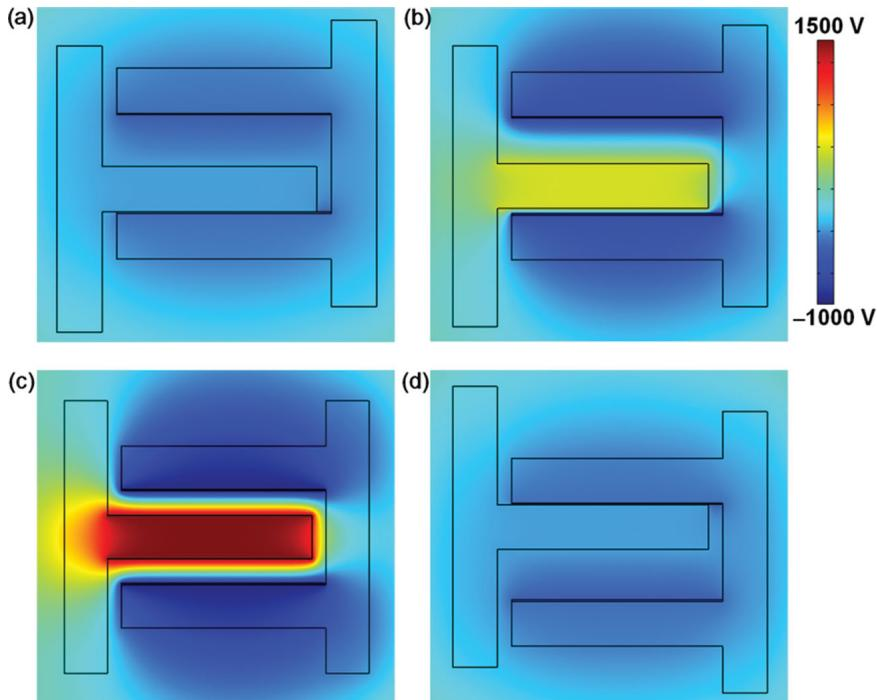
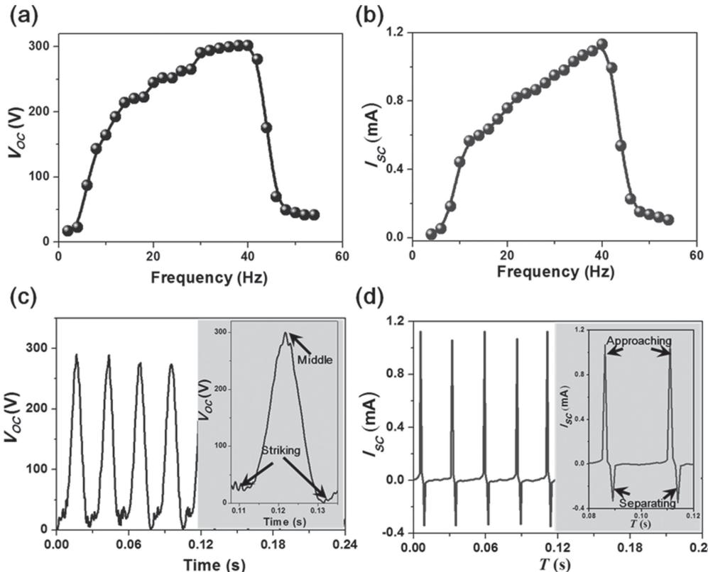
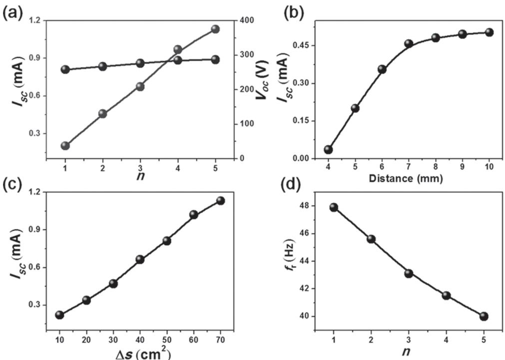
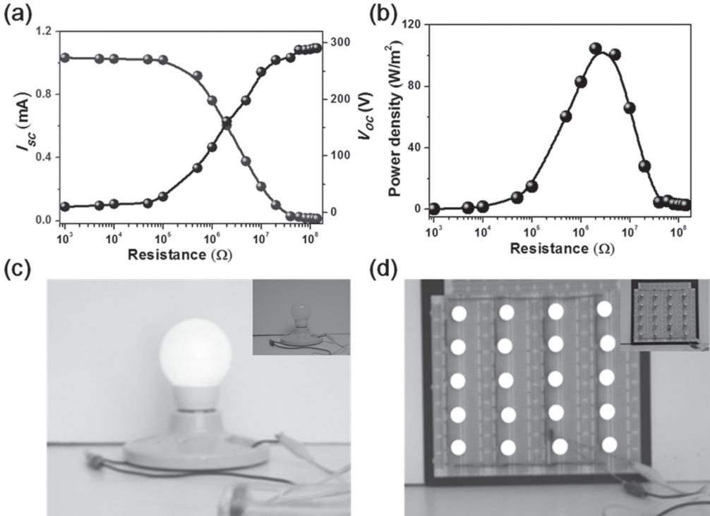
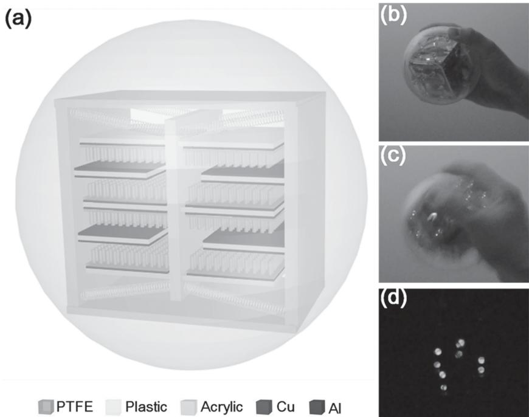

# 3D Stack Integrated Triboelectric Nanogenerator for Harvesting Vibration Energy

Weiqing Yang , Jun Chen , Qingshen Jing , Jin Yang , Xiaonan Wen , Yuanjie Su , Guang Zhu , Peng Bai , and Zhong Lin Wang \*

The applications of a single-layer triboelectric nanogenerator (TENG) may be challenged by its lower output current, and a possible solution is to use three-dimensional (3D) integrated multilayered TENGs. However, the most important point is to synchronize the outputs of all the TENGs so that the instantaneous output power can be maximized. Here, a multi-layered stacked TENG is reported as a cost-effective, simple, and robust approach for harvesting ambient vibration energy. With superior synchronization, the 3D-TENG produces a short-circuit current as high as $1 . 1 4 \mathsf { m } \mathsf { A }$ , and an open-circuit voltage up to 303 V with a remarkable peak power density of $1 0 4 . 6 \mathrm { W } \mathrm { m } ^ { - 2 }$ . As a direct power source, it is capable of simultaneously lighting up 20 spot lights (0.6 W ea.) as well as a white G16 globe light. Furthermore, compared with the state-of-the-art vibration energy harvesters, the 3D-TENG has an extremely wide working bandwidth up to $3 6 H z$ in low frequency range. In addition, with specifi c dimensional design, the 3D-TENG is successfully equipped inside a ball with a diameter of 3 inches, using which 32 commercial LEDs are simultaneously lighted up via hand shaking, exhibiting great potential of scavenging the abundant but wasted kinetic energy when people play basketball, football, baseball, and so on.

# 1. Introduction

Tremendous amounts of vibration energy extensively exist in ambient environment, such as ocean waves, vehicle systems, highway, bridge and building vibration. And the majority of the ambient vibrations are dominant at very low frequencies. [ 1,2 ] Nowadays, harvesting vibration energy mainly focuses on piezoelectric, [ 3–6 ] electrostatic, [ 7–9 ] magnetostrictive effect, [ 10–12 ] aiming at building up self-powdered systems to drive small electronics. [ 11,12,14 ]

Recently, triboelectric nanogenerator, [ 13–22 ] a conjunction use of the universally known contact electrifi cation effect [ 23–28 ] and electrostatic induction, has been proved to be a cost-effective and robust approach for harvesting ambient mechanical energy. A challenge to TENG is its relatively low output current but a high voltage output. Recently, we developed an integrated rhombic gridding based TENG as an effective solution to this problem through structurally multiplied unit cells connected in parallel. [ 16 ] However, since the current output of each unit is a pulse at the moment when two contact surfaces approaching and separating, [ 13–22 ] in such short period of time, these units are impossible to operate in a synchronized manner to maximize the power output. Here, we present a 3D stack integrated TENG that is designed to rationally solve this problem. With polytetrafl uoroethylene (PTFE)

nanowire arrays as surface modifi cation, the open-circuit voltage $( V _ { \mathrm { o c } } )$ and short-circuit current $( \boldsymbol { I _ { \mathrm { s c } } } )$ of the TENG reach up to $3 0 3 \mathrm { ~ V ~ }$ and $1 . 1 4 ~ \mathrm { m A }$ , respectively, corresponding to a remarkable peak power density of 104.6 W $\mathrm { m } ^ { - 2 }$ . Moreover, the 3D-TENG shows an extremely wide working bandwidth up to $3 6 \mathrm { H z }$ in low vibration frequency range. The generated power by the TENG is high enough to simultaneously light up more than 20 spot lights (0.6 W ea.) as well as a white globe light, which unambiguously demonstrated the capability of the 3D-TENG acting as a sustainable power source for mobile electronics. In addition, with specifi c dimensional design, we integrated a 3D-TENG inside a ball with a diameter of 3 inches, the generated power by hand shaking simultaneously lighted up 32 commercial LEDs, which greatly demonstrated its capability of harvesting kinetic energy when people play various kinds of ball sports. And also, a large amount of these self-powered balls can also be woven into webs for ocean wave energy harvesting, which can be potentially applied to large-scale energy generation.

# 2. Design and Analysis

The 3D-TENG has a multilayered structure with acrylic as supporting substrates, as schematically shown in Figure 1 a.

  
Figure 1. Three-dimensional triboelectric nanogenerator. a) Schematic of a 3D-TENG. b) SEM image of nanopores on aluminum electrode. c) A photograph of the as fabricated 3D-TENG.

Acrylic was selected as the structural material due to its decent strength, light weight, good machinability and low cost. A photograph of an as-fabricated TENG is shown in Figure 1 b, in which, the total number of the unit cells can be expressed as:

$$
N _ { \mathrm { t o t a l } } = 4 n
$$

where $n$ is the number of pinned fi ngers of a TENG and its defi nition is illustrated in Figure S1 (Supporting Information).

Eight identical springs were employed to bridge the moveable and pinned fi ngers. All fi ngers were made from acrylic sheets with a thickness of $3 \mathrm { m m }$ and parallel to each other with identical but tuneable gap distance. The thickness of acrylic sheets is large enough to prevent the mutual charges infl uences among the unit cells. [ 16,22 ] Moreover, all the unit cells are electrically connected in parallel, which is illustrated in Figure S2 (Supporting Information). Aluminium thin fi lms were deposited onto both sides of the pinned fi ngers, which played dual roles of a contact electrode and a contact surface. A layer of polytetrafl uoroethylene (PTFE) fi lm was adhered to the both sides of the movable fi ngers with deposited copper as another electrode. PTFE nanowires arrays were created on the exposed PTFE surface by a top-down method through reactive ion etching. SEM image of the PTFE nanowires is displayed in Figure 1 c. Additionally, to promote the triboelectrifi cation and to increase the effective contact area between the two contacting surfaces, PTFE nanowires are created as surface modifi cations, which greatly increases the triboelectric charges and thus the overall electrical output. Detailed fabrication specifi cations are presented in the Experimental Section.

Once the 3D-TENG is being triggered by an external vibrational source, a periodic of electricity generation process is illustrated in Figure 2 . A periodic contact and separation between two materials with opposite triboelectric polarities alternatingly drives induced electrons through external circuit due to process for the 3D-TENG is illustrated in Figure 2 e–h.

  
Figure 2. A sketch illustrating the working principle of the 3D-TENG. a) The positive and negative triboelectric charges are respectively generated on the aluminum side and the PTFE side due to contact electrifi cation. b) The applied external force causes a separation. Electric potential difference drives electrons from the back electrode to contact electrode, screening the induced charges. c) A pinned fi nger arrived at the middle position between two adjacent movable fi ngers. All of the electrons in the back electrode are almost driven to the contact electrode. d) The pinned fi ngers keeps relatively moving up due to the inertia and contacts with upper movable fi ngers. e–h) A complete cycle of electricity generation process for the 3D-TENG.

  
Figure 3. Finite element simulation of the periodic potential change between the two electrodes upon vertical contact and separation, showing the driving force for the back-and-forth charge fl ow generated by the TENG. A cycle is generally divided into four states: a) Initial contact. b) Separation after contact. c) A pinned fi nger arrives at the middle position between two adjacent movable fi ngers. d) The pinned fi nger arrives and contacts with the upper movable fi nger.

Additionally, in order to consolidate the working principle of the 3D-TENG, by virtue of COMSOL, we took a further step to simulate the periodic potential change between the two electrodes upon vertical contact and separation, as demonstrated in Figure 3 a–d. And the continuous variation of the potential distribution is visualized in Supporting Information Movie 1.

In an as-fabricated 3D-TENG, all of the fi ngers are not only structurally parallel to each other, but also electrically connected in parallel. To evaluate the TENG's performance for harvesting vibration energy, an electrodynamic shaker (Labworks Inc.) that provides sinusoidal wave was employed as an external vibration source with tunable frequency and amplitude. The bottom substrate of the 3D-TENG with $n = 5$ was anchored on the shaker. At a fi xed vibration amplitude, the reliance of electric output on the input vibration frequency is presented in Figure 4 a,b, which was measured with input frequency varying from $2 \ \mathrm { ~ H z ~ }$ to 54 the coupling of triboelectric effect and electrostatic induction effect. [ 13–22 ] At the original position, all pinned fi ngers are stationary and stay in the middle of two adjacent movable fi ngers. Due to the applied external vibration, the pinner fi ngers will be brought to contact with the moving fi ngers. According to the triboelectric series, [ 29 ] electrons are injected from aluminium electrode into PTFE, [ 13–16,24,30–32 ] resulting in negative charges at the surface of the PTFE fi lm and positive charges at the aluminium electrode, as demonstrated in Figure 2 a. Subsequently, external vibration induced relative motion will cause a separation between the pinned and movable fi ngers, producing an electric potential difference across the electrodes, which drives most electrons from back electrode to the contact electrode through the external circuit in an ultrashort period of time, screening the positive triboelectric charges on the back electrode, as shown in Figure 2 b. When the pinned fi ngers reach the middle position of two adjacent movable fi ngers, the positive triboelectric charges are almost neutralized by the inductive electrons (Figure 2 c). After the middle point, continuous relative motion will bring about a second contact and thus triboelectrifi cation between the moving and pinned fi ngers, as demonstrated in Figure 2 d. Owing to the periodicity of applied vibration motion, the pinned fi ngers will separate from the movable fi ngers a second time, and thus another electric potential difference is emerged and maximized when the pinned fi ngers come back to the middle point (Figure 2 e). In a cycle of vibration motion, two contacts and two separations will occur, corresponding to four current pulses in the external circuit. And a complete cycle of electricity generation

# 3. Results and Discussion

Hz, indicating that $4 0 ~ \mathrm { H z }$ is the resonance frequency of the TENG. Compared to the state-of-the-art vibration energy harvesters that are based on nonlinear and topology variation, [ 33–35 ] it has a wide working bandwidth of $3 6 ~ \mathrm { H z }$ in low frequency range (Figure S3, Supporting Information). As demonstrated in Figure 4 c,d, the open-circuit voltage $( V _ { \mathrm { o c } } )$ and short-circuit current $( \boldsymbol { I _ { \mathrm { s c } } } )$ are respectively as high as $3 0 3 \mathrm { ~ V ~ }$ and $1 . 1 4 ~ \mathrm { m A }$ at the resonance vibration frequency of $4 0 ~ \mathrm { H z }$ . Insets are the enlarged view of the output signals in one cycle of vibration. It is worth noting that $I _ { \mathrm { s c } }$ has an alternating behavior with asymmetrical amplitudes. And it is found that, the larger peaks correspond to the process in which the two fi ngers approach each other, while the smaller ones are generated as the two fi ngers move apart after contacting. Given the same amount of charges (ΔQ ) transported back and forth, a faster approaching is expected to produce larger current peaks $\mathrm { \Delta } I _ { \mathrm { s c } } = \Delta Q / \Delta t )$ than that during the slower separation.

Additionally, we take a further step to make a systematical study of the reliance of current output on the design parameters, such as, the number of pinned fi ngers $n$ , effective contact area $\Delta S$ and gap distance between the two adjacent fi ngers $\Delta d .$ .

Theoretically, the short-circuit current of the 3D-TENG can be expressed as (see Figure S4 and other Supporting Information for detailed derivation of the analytical model): [ 16 ]

$$
I _ { \mathrm { s c } } = \frac { \sigma s d _ { 0 } \nu } { \displaystyle \varepsilon _ { \mathrm { r } } \left[ d + \frac { d _ { 0 } } { \varepsilon _ { \mathrm { r } } } \right] ^ { 2 } }
$$

  
Figure 4. Electrical measurement results of a 3D-TENG with $n = 5$ . a) Open-circuit voltage $( V _ { \mathrm { o c } } )$ as a function of vibration frequency. b) Short-circuit current $( I _ { \mathsf { s c } } )$ as a function of vibration frequency. c) Open-circuit voltage $( V _ { \mathrm { o c } } )$ at resonant frequency of $4 0 ~ \mathsf { H z }$ . Inset is an enlarged view of a cycle. d) Short-circuit current $( I _ { \mathsf { s c } } )$ at resonant frequency of $4 0 ~ \mathsf { H z }$ . Inset is an enlarged view of a cycle.

where $d _ { 0 }$ is the thickness of PTFE, $\varepsilon _ { \mathrm { r } }$ is the relative permittivity of PTFE, s is the effective contact area and $\nu$ is the relative velocity at which they will contact, whose motion direction determines the fl owing direction of the induced charge, and thus the direction of the short circuit current.

Experimentally, as shown in Figure 5 a, the voltage output is almost constant for 3D-TENG with $n = 1 { - } 5$ , which is attributed to the electrically parallel connection among all the units. However, the current output is a monotonically increasing function of $n$ throughout the experimental time window. And the current enhancement factor $\alpha$ is a function of $n$ , $\alpha = b n$ , the measured result $b$ is very close to the ideal coeffi cient of 2 (Figure S5, Supporting Information). Such a high coeffi - cient $b$ is mainly owing to the operating synchronicity of all units, which convincingly demonstrates the effectiveness of our approach for current output enhancement. Likewise, a monotonically increasing relationship was observed between the current output and the effective contact area $\Delta S$ as well as parameter $\Delta d _ { \mathrm { { i } } }$ as shown in Figure 5 b,c. A larger $\Delta d$ will contribute to a larger relative velocity of the two contact plates, and thus renders us a higher output current, according to Equation 2 . In addition, as a vibration energy harvester, we also investigate the reliance of the natural frequency on the number of pinned fi ngers $n$ for the 3D-TENG. As indicated in Figure 5 d, the resonance frequencies $f _ { \mathrm r }$ decrease as increasing $n$ , which is well consistent with a typical vibration system that a larger mass will lead to a smaller system natural frequency. [ 33–35 ]

Resistors were utilized as external loads to further investigate the output power of the 3D-TENG at its resonance frequency. As displayed in Figure 6 a, the current amplitude drops with increasing load resistance owing to the Ohmic loss, while the voltage follows a reverse trend. Consequently, the instantanenous peak power $( P = I _ { \mathrm { \ p e a k } } ^ { 2 } R )$ is maximized at a load resistance of $2 \ : \mathrm { M } \Omega$ , coresponding to a peak power density $( P _ { \mathrm { d } } { = } I _ { \mathrm { \ p e a k } } ^ { 2 } R / \Delta S )$ of 104.6 W $\mathrm { m } ^ { - 2 }$ (Figure 6 b). In addition, the robustness is another critical criterion for the energy harvesters. As demonstrated in Figure S6 (Supporting Information), only a slight drop of about $2 \%$ is observed for the short-circuit current after more than 1.0 million cycles of vibration.

To prove the capability of the 3D-TENG as a sustainable power source, three sets of practical applications were demonstrated. First, as shown in Figure 6 c, the TENG was excited by an electrodynamic shaker at a vibration frequency of $4 0 ~ \mathrm { H z }$ lighting up a white G16 globe light (Supporting Information Movie 2). Inset is a photograph when a white G16 globe light is off. Meanwhile, a total of 20 spot lights (0.6 W ea.) connected in series were lighted up simultaneously and continuously without observable fl ashing. Inset is a photograph when the spot lights are off. (Figure 6 d and Supporting Information Movie 3).

In addition, with specifi c dimensional design, we integrated a 3D-TENG into a ball with a diameter of 3 inches, as schematically shown in Figure 7 a and a photograph of the as-fabricated devices in Figure 7 b. In order to directly demonstrate the equipped ball as an energy harvester, we installed four faces of the inside TENG with 8 LEDs as indicators on each face. As shown in Figure 7 c, the generated power by hand shaking simultaneously lighted up 32 commercial LEDs (Supporting Information Movie 4). And Figure 7 d demonstrates that 8 LEDs on one of the four faces were lighted up in complete darkness. This practical application greatly demonstrated the capability of our 3D-TENG for harvesting kinetic energy when people play various kinds of ball sports. It is worth noting that, large amount of these self-powered balls can also be woven into webs for ocean wave energy harvesting, which can be potentially applied for large-scale energy generation.

  
Figure 5. A systematical study of the reliance of current electric output on the design parameters. a) Dependence of electric output on the number of pinned fi ngers n . b) Dependence of the short-circuit current on the gap distance between two adjacent pinned fi ngers for the TENG with $n = 2$ . c) Dependence of short-circuit current on effective contact area (ΔS ) of the TENG with $n = 5$ . d) The device natural frequency as a function of the number of pinned fi ngers $n$ .

  
Figure 6. Demonstration of the 3D-TENG as a direct power source. a) Dependence of the voltage and current output on the external load resistance for the TENG with $n = 5$ . The points represent peak values of electric signals while the lines are the fi tted results. b) Dependence of the peak power output on the resistance of the external load for the TENG with $n = 5$ , indicating maximum power output at $R = 2$ MΩ. The curve is a fi tted result. c) Photograph of a white G16 globe light that is directly powered by the TENG (Input frequency $4 0 \mathsf { H z }$ ). Inset is a photograph when a white G16 globe light is off. d) Photograph of 20 spot lights (0.6 W ea.) connected in series that are lighted up simultaneously and continuously without observable strobofl ash by the TENG (Input frequency $4 0 \mathsf { H z }$ ). Inset is a photograph when the spot lights are off.

  
Figure 7. Demonstration of the 3D-TENG as it is equipped inside a ball, which has great potential of scavenging the kinetic energy when people play basketball, football, baseball and so on. Large amount of these self-powered balls can be also woven into webs for ocean wave energy harvesting, which can be potentially applied for large-scale energy generation. A sketch a) and a photograph b) of a self-powered ball. c) When shaking the ball, about 32 commercial LEDs are lighted up simultaneously. d) A photograph of 8 LEDs on a face of the device that are directly powered by the TENG in complete darkness (We equipped four faces of the devices with 8 LEDs on each face).

# 4. Conclusions

We have designed a 3D-TENG that is a multilayered integration of the TENGs for enhancing the output current. At the resonance frequency, it produces an open-circuit voltage of $3 0 3 \mathrm { ~ V } ,$ a short-circuit current up to $1 . 1 4 ~ \mathrm { m A }$ , corresponding to a peak power density of $1 0 4 . 6 ~ \mathrm { { W } ~ m } ^ { - 2 }$ . It can effectively respond to input vibration frequency from $2 \ \mathrm { ~ H z ~ }$ to $5 4 \ \mathrm { H z }$ with an extremely wide working bandwidth of $3 6 ~ \mathrm { H z }$ in low frequency range. More importantly, with specifi c dimensional design, the 3D-TENG can be integrated into a ball with arbitary size, which can be utilized to harvest kinetic energy when people play basketball, football, baseball and so on. Ocean wave energy can also be effectively harvested by weaving large amount of these self-powered balls into webs. In a word, given its remarkable electric output power and other major advantages in weight, cost, scalability and adaptability, the TENG presented in this work is a practical approach in convertingto harvest ambient vibration energy for self-powered electronics as well as possibly for producing electricity on a large scale.

# 5. Experimental Section

Nanowires Based PTFE Surface Modifi cation : A layer of $1 0 0 \ \mathsf { n m }$ copper was fi rstly deposited onto the PTFE thin fi lm with thickness of $5 0 ~ \mu \mathsf { m }$ . Then, reliance on the ICP reactive ion etching method, the aligned PTFE nanowires were created onto the copper coated PTFE surface. In the etching process, $O _ { 2 }$ , Ar, and ${ \mathsf { C F } } _ { 4 }$ gases were injected into the ICP chamber with fl ow ratios of 10.0, 15.0, and 30.0 sccm, respectively. Plasma with a large density was generated by a power source of 400 W·A, and accelerated by another power of 100 W. The aligned PTFE nanowires were obtained after a 40-secondetching process.

Fabrication of 3D-TENG : Acrylic sheets with thickness of $6 \mathsf { m m }$ were shaped by a laser cutter as the frameworks of our TENG. Both the pinned and movable fi ngers are identical to each other and made from the acrylic sheets with thickness of $3 \ \mathsf { m m }$ with a size of $1 . 4 ~ \mathsf { c m }$ by $5 ~ { \mathsf { c m } }$ . A layer of aluminium thin fi lm with thickness of $1 0 0 \ \mathsf { n m }$ was deposited onto the both sides of pinned fi ngers as the contact electrodes by physical vapour deposition. And the as-prepared PTFE thin fi lm with nanowires surface modifi cation was adhered onto the movable fi ngers. Then, all the fi ngers were anchored fi rmly onto the framework with designed and tuneable gap distances. Lead wires were connected for electrical measurement.

# Supporting Information

Supporting Information is available from the Wiley Online Library or from the author.

# Acknowledgements

This work was supported by U.S. Department of Energy, Offi ce of Basic Energy Sciences (Award DE-FG02–07ER46394), the “thousands talents” program for pioneer researcher and his innovation team, China, Beijing City Committee of science and technology project (Z131100006013004) and National Natural Science Foundation of China, NSFC (No. 51202023).

Received: December 18, 2013   
Revised: January 14, 2014   
Published online: March 24, 2014

[6] R. S. Yang , Y. Qin , L. M. Dai , Z. L. Wang , Nat. Nanotech. 2008 , 4 , 34 .   
[7] S. P. Beeby , M. J. Tudor , N. M. White , Meas. Sci. Technol. 2006 , 17 , R175 .   
[8] S. Roundy , P. Wright , K. Pister , Proc. IMECE 2002 , pp 1 – 10 .   
[9] P. D. Mitcheson , E. M. Yeatman , G. Kondala Rao , A. S. Holmes , T. C. Green , Proc. IEEE 2008 , 96 , 1457 .   
[10] L. Wang , F. G. Yuan , Smart Mater. Struct. 2008 , 17 , 045009 .   
[11] I. N. Ayala-Garcia , P. D. Mitcheson , E. M. Yeatmanm , D. Zhu , J. Tudor , S. P. Beeby , Sens. Actuators, A 2013 , 189 , 266 .   
[12] Y. Wei , R. Yorah , K. Yang , S. P. Beeby , J. Tubor , Meas. Sci. Technol. 2013 , 24 , 075104 .   
[13] F.-R. Fan , Z.-Q. Tian , Z. L. Wang , Nano Energy. 2012 , 1 , 328 .   
[14] F.-R. Fan , L. Lin , G. Zhu , W. Wu , R. Zhang , Z. L. Wang , Nano Lett. 2012 , 12 , 3109 .   
[15] J. Chen , G. Zhu , W. Yang , Q. Jing , P. Bai , Y. Yang , T. C. Hou , Z. L. Wang , Adv. Mater. 2013 , 25 , 6094 .   
[16] W. Yang , J. Chen , G. Zhu , J. Yang , P. Bai , Y. Su , Q. Jing , X. Cao, Z. L. Wang , ACS Nano 2013 , 7 , 11317 .   
[17] Y. Yang , H. Zhang , J. Chen , Q. Jing , Y. Zhou , X. Wen , Z. L. Wang , ACS Nano 2013 , 7 , 7342 .   
[18] W. Yang , J. Chen , G. Zhu , X. Wen , P. Bai , Y. Su , Y. Lin , Z. L. Wang , Nano Res. 2013 , 6 , 880 .   
[19] P. Bai , G. Zhu , Y. Liu , J. Chen , Q. Jing , W. Yang , J. Ma , G. Zhang , Z. L. Wang , ACS Nano 2013 , 7 , 6361 .   
[20] J. Yang , J. Chen , Y. Yang , H. Zhang , W. Yang , P. Bai , Y. Su , Z. L. Wang , Adv. Energy Mater. 2013 , DOI: 10.1002/aenm.201301322 .   
[21] G. Zhu , J. Chen , Y. Liu , P. Bai , Y. Zhou , Q. Jing , C. Pan , Z. L. Wang , Nano Lett. 2013 , 13 , 2282 .   
[22] P. Bai , G. Zhu , Z. H. Lin , Q. Jing , J. Chen , G. Zhang , J. Ma , Z. L. Wang , ACS Nano 2013 , 7 , 3713 .   
[23] J. Lowell , A. C. Roseinnes , Adv. Phys. 1980 , 29 , 947 .   
[24] G. S. P. Castle , J. Electrost. 1997 , 40–1 , 13 .   
[25] R. G. Horn , D. T. Smith , Science 1992 , 256 , 362 .   
[26] R. G. Horn , D. T. Smith , A. Grabbe , Nature 1993 , 366 , 442 .   
[27] H. T. Baytekin , A. I. Patashinskii , M. Branicki , B. Baytekin , B.A. Grzybowski , Science 2011 , 333 , 308 .   
[28] S. Soh , S. W. Kwok , H. Liu , G.vM. Whitesides , J. Am. Chem. Soc. 2012 , 134 , 20151 .   
[29] J. A. Cross , Adam Hilger : Bristol , 1987 , Ch. 2 .   
[30] E. Nemeth , V. Albrecht , G. Schulert , F. Simon , J. Electrost. 2003 , 58 , 3 .   
[31] A. F. Diaz , R. M. Felix-Navarrro , J. Electrost. 2004 , 62 , 227 .   
[32] G. M. Sessler , Springer-Verlag Berlin Heidelberg: New York 1987 , Ch. 2.   
[33] H. C. Liu , C. K. Lee , T. Kobayashi , C. J. Tay , C. G. Quan , Smart Mater. Struct. 2012 , 21 , 035005 .   
[34] X. Y. Wang , S. Palagummi , L. Liu , F. G. Yuan , Smart Mater. Struct. 2013 , 22 , 055016 .   
[35] K. Ashraf , M. H. M. Khir , J. O. Dennis , Z. Baharudin , Smart Mater. Struct. 2013 , 22 , 025018 .