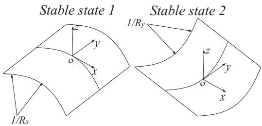
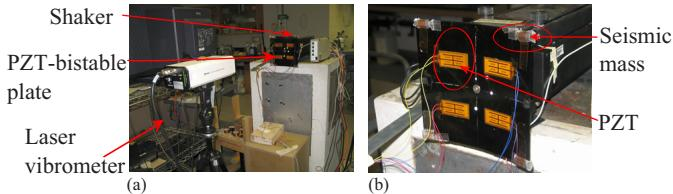
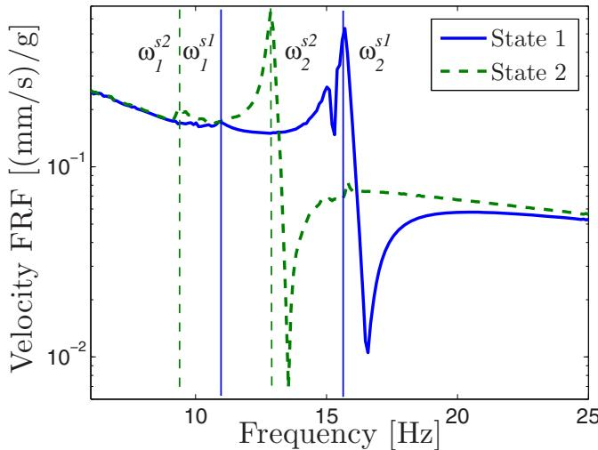
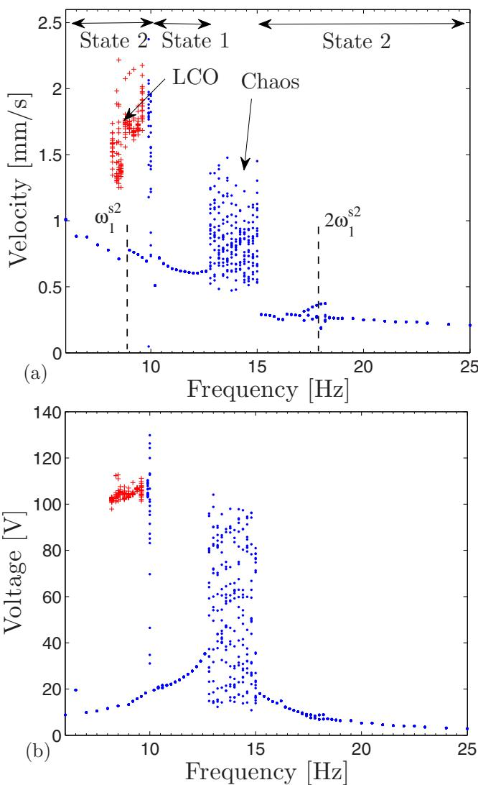
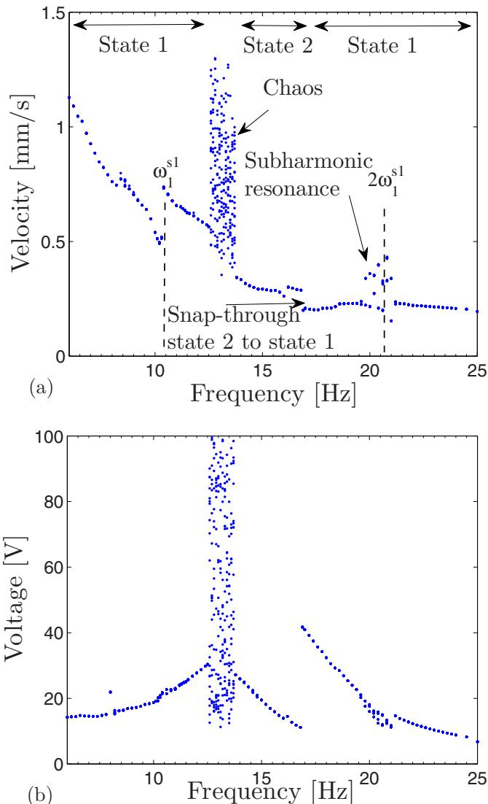
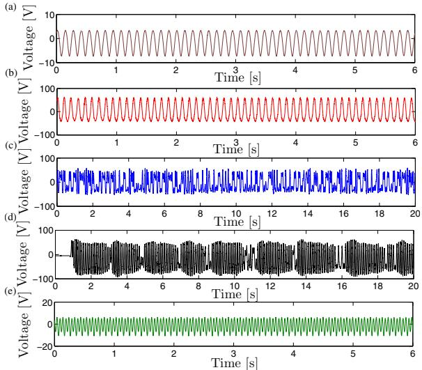
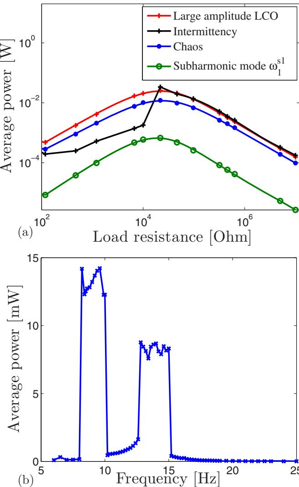

# A piezoelectric bistable plate for nonlinear broadband energy harvesting

A. F. Arrieta, P. Hagedorn, A. Erturk, and D. J. Inman

Citation: Applied Physics Letters 97, 104102 (2010); doi: 10.1063/1.3487780   
View online: http://dx.doi.org/10.1063/1.3487780   
View Table of Contents: http://scitation.aip.org/content/aip/journal/apl/97/10?ver=pdfcov   
Published by the AIP Publishing

# Articles you may be interested in

An innovative tri-directional broadband piezoelectric energy harvester Appl. Phys. Lett. 103, 203901 (2013); 10.1063/1.4830371

Bi-stable energy harvesting based on a simply supported piezoelectric buckled beam J. Appl. Phys. 114, 114507 (2013); 10.1063/1.4821644

Broadband vibration energy harvesting based on cantilevered piezoelectric bi-stable composites Appl. Phys. Lett. 102, 173904 (2013); 10.1063/1.4803918

Nonlinear output properties of cantilever driving low frequency piezoelectric energy harvester Appl. Phys. Lett. 101, 223503 (2012); 10.1063/1.4768219

Theoretical investigations  energy harvesting efficiency from structural vibrations using piezoelecti and   
electromagnetic oscillators   
J. Acoust. Soc. Am. 132, 162 (2012); 10.1121/1.4725765

# A piezoelectric bistable plate for nonlinear broadband energy harvesting

AF. Arrieta,P. Hagedorn,A. Erturk, and D. J. Inan   
1System Reliability and Machine Acoustics, Dynamics and Vibrations Group, Technische Universität   
Darmstadt, LOEWE-Zentrum AdRIA, Darmstadt 64289 Germany   
2Department of Mechanical Engineering, Center for Intelligent Material Systems and Structures,   
Virginia Polytechnic Institute and State University, Blacksburg, Virginia 24061, USA

(Received 14 June 2010; accepted 18 August 2010; published online 7 September 2010)

Recently, the idea of using nonlinearity to enhance the performance of vibration-based energy harvesters has been investigated. Nonlinear energy harvesting devices have been shown to be capable of operating over wider frequency ranges delivering more power than their linear counterparts, rendering them more suitable for real applications. In this paper, we propose to exploit the rich nonlinear behavior of a bistable composite plate with bonded piezoelectric patches for broadband nonlinear energy harvesting. The response of the structure is experimentally investigated revealing different large amplitude oscillations. Substantially large power is extracted over a wide frequency range achieving broadband nonlinear energy harvesting. $©$ 2010 American Institute of Physics. [doi:10.1063/1.3487780]

Vibration-based energy harvesting has received extensive attention over the past decade. The basic mechanisms used for transforming vibrations into electric energy include piezoelectric, electromagnetic, electrostatic, and magnetostrictive transduction.' Regardless of the conversion mechanism, energy harvesting devices have been designed to operate optimally at or very close to resonance. However, ambient vibrations generally show multiple frequencies which may drift over time, rendering typical linear harvesting systems unsuitable for most practical purposes. To address this issue, researchers have recently proposed broadband energy harvesting exploiting nonlinearity to achieve a wider range of high energy conversion have been proposed showing encouraging results in this research direction.4,6 This paper presents a broadband harvesting concept based on piezoelectric bistable composite plates. Bistable composites have been studied in the past for morphing applications due to their ability to attain two statically stable shapes.' This bistability property leads to rich dynamics including different nonlinear large amplitude oscillations occurring over a wide frequencies range.8 By adding flexible piezoelectric patches to a bistable plate, high energy levels are converted from the nonlinear oscillations obtaining a broadband harvesting device. Unlike the bistable cantilevers studied in Refs. 3, 4, and 6, bistability of the plate studied in this work does not require strong external magnets which may be obtrusive for the powered electrical components, as well as for the circuitry of harvester itself. Furthermore, in the absence of magnets bistable plates can be designed to occupy smaller volumes than bistable cantilevers. Moreover, having two length dimensions offers flexibility in designing the harvester for broader conversion bandwidth.

  
FIG. 1. Statically stable states of the bistable plate.

The two stable states of the piezoelectric bistable composite plate used for developing a broadband harvesting device are schematically shown in Fig. 1. A $[ 9 0 _ { 2 } - 0 _ { 2 } ]$ $2 0 0 \times 2 0 0$ carbon fiber epoxy bistable composite plate with seismic masses attached to each corner to obtain a more flexible structure is employed as experimental specimen. The plate is mounted from its center to an electromechanical shaker, as shown in Fig. 2(a). Four PZT-5A flexible piezoelectric patches are bonded to the surface of the bistable plate using a high shear strain epoxy, as shown in Fig. 2(b). The piezoelectric patches are connected in parallel to a simple resistor serving as electrical load. The dynamic response of the plate is first studied confined to each stable state using frequency response functions (FRF) for a very low forcing amplitude of $0 . 0 5 \ \mathrm { g }$ to minimize nonlinear effects, shown in Fig. 3 for each state. Two modes can be observed on each stablee state, $\omega _ { 1 } ^ { s 1 }$ and $\omega _ { 2 } ^ { s 1 }$ at 10.9 and $1 5 . 8 \ \mathrm { H z }$ for stable state 1, and $\omega _ { 1 } ^ { s 2 }$ and $\omega _ { 2 } ^ { s 2 }$ at 9.4 and $1 2 . 9 \ : \mathrm { H z }$ for stable state 2. The nonlinear behavior of the bistable plate is studied using experimental frequency response diagrams, which combine the concepts of FRF and Poincaré maps to provide information of modal properties and nonlinear oscillations. These ia grams are obtained using a single harmonic constant seismic acceleration input for forward and backward frequency sweeps. Peak-to-peak amplitudes of response are sampled over several consecutive forcing periods of steady state motions and plotted using the forcing frequency as parameter. For a linear response, a single amplitude value is sampled for consecutive periods for a given forcing frequency. Conversely, several points for a given frequency indicate the presence of multiple harmonics in the response signaling nonlinear oscillations. In particular, a dense cluster of points covering a broad range of amplitudes for a forcing frequency suggest chaotic behavior as in bifurcation diagrams.9

  
FIG. 2. (Color online) (a) Experimental apparatus. (b) Close-up view for the configuration of the piezoelectric patches.

  
FIG. 3. (Color online) Experimental velocity-to-base acceleration FRFs for small oscillations around state 1 and state 2.

  
FIG. 4. (Color online) Experimental frequency response diagrams with initial condition at state 2 for a forcing level of $_ { 2 \mathrm { ~ g ~ } }$ and forward sweep. Peak-This arto-peak $\mathbf { \Pi } _ { ( \mathrm { a } ) } ^ { ( \mathrm { a } ) }$ yelosity $\mathrm { ( b ) }$ piezoelectric voltagecle. Reuse of AlP content is

  
FIG. 5. (Color online) Experimental frequency response diagrams with initial condition at state 1 for a forcing level of $_ { 2 \mathrm { ~ g ~ } }$ and backward sweep. Peak-to-peak (a) velocity (b) piezoelectric voltage.

Frequency response diagrams for velocity and piezoelectric voltage with initial condition at stable state 2 stepping up the frequency from $6 \ : \mathrm { H z }$ for a forcing amplitude of $2 . 0 \ \mathrm { g }$ are shown in Fig. 4. On the top of the diagram, the state at which oscillations take place is indicated where appropriate. Different types of nonlinear large amplitude oscillations occurring over wide frequency ranges can be seen including 1/2 subharmonic oscillations, chaotic as well as large amplitude limit cycle oscillations (LCO) analogous to those observed in the bistable beam configuration in Ref. 4. Subharmonic oscillations are confined to a stable state, whereas chaotic and large amplitude LCO for this configuration and control parameters involve snap-through between stable states. Large amplitude velocities have a strong correlation to the voltage on the piezoelectric configuration, particularly high voltages are obtained for chaotic response and LCO. Note that LCO observed for the range between $8 { \mathrm { - } } 1 0 . 2 \ : \mathrm { H z }$ coexist with a low amplitude linear solution (not all coexisting solutions are shown)Foroscillations starting at/stable state frequency response diagrams for velocity and piezoelectric voltage stepping down the frequency from $2 5 \ \mathrm { H z }$ for a forcing amplitude of $2 . 0 \ \mathrm { g }$ are shown in Fig. 5. In this case, 1/2 subharmonic and chaotic oscillations are observed. As for oscillations starting at state 2, strong correlation is observed between high velocities and piezoelectric voltages particularly for chaotic oscillations. We present a sample of time series for each of the relevant nonlinear oscillations in Fig. 6.

  
FIG. 6. (Color online) Time series for open-circuit voltage output for a forcing level of $2 \mathrm { g }$ (a) Linear response at $7 . 5 \ : \mathrm { H z }$ . (b) Large amplitude LCO at $8 . 6 \ : \mathrm { H z }$ (c) Chaotic oscillations at $1 2 . 5 \ \mathrm { H z }$ (d) Intermittency oscillations at $9 . 8 \ : \mathrm { H z }$ (e) 1/2 Subharmonic oscillations $\omega _ { 1 } ^ { s 1 }$ at $2 0 . 2 \ : \mathrm { H z }$ (Initial condition on stable state 2, except for subharmonic oscillations of mode $\omega _ { 1 } ^ { s 1 }$ .

In order to obtain the load maximizing the harvested power, a resistor sweep is performed for each of the relevant large amplitude responses, shown in Fig. 7(a). Very high electrical power output is obtained for intermittency and large amplitude LCO giving $3 4 ~ \mathrm { m W }$ and $2 7 \mathrm { \ m W }$ respectively, for an acceleration forcing level of $2 . 0 ~ \mathrm { g }$ For chaotic motions, the maximum average power was found to be 9 mW, a significant level considering the wide range of frequencies over which this response can occur. For 1/2 subharmonic response of mode $\omega _ { 1 } ^ { \bar { s 1 } }$ , the harvested power is much less in comparison to the other observed nonlinear regimes. However, given the large deflections experienced by the plate for these oscillations it may be possible to obtain higher levels of power optimizing the configuration of the piezoelectric transducers, effectively extending the range of frequencies where high energy conversion can be obtained. Figure 7(b) presents the average power as a function of the forcing frequency for oscillations with initial condition at stable state 2 for a load of $9 8 . 5 ~ \mathrm { k } \Omega $ .Even for this nonoptimal load, large average power is harvested over a wide range of frequencies showing the broadband characteristic of the proposed device. The rich dynamics of a bistable plate has been exploited for nonlinear energy harvesting. Large average power was harvested from intermittency, limit cycle and chaotic oscillations for responses with initial condition on both stable states. Combining the ranges where large amplitude oscillations occur gives a broadband energy harvesting device. The bistability of the plate studied herein does not require strong magnets unlike bistable magnetoelastic cantilevers. Although a square plate configuration is tested here, having two length dimensions offers design flexibility for multiple resonances.

  
FIG. 7. (Color online) (a) Experimental average power vs load resistance for: large amplitude LCO at $8 . 6 \ \mathrm { H z }$ , intermittency oscillations at $9 . 8 \ \mathrm { H z }$ chaotic oscillations at $1 2 . 5 \ \mathrm { H z }$ , 1/2 subharmonic oscillations of mode $\omega _ { 1 } ^ { s 1 }$ at $2 0 . 2 \ \mathrm { H z }$ (b) Average power vs forcing frequency, load resistance $9 8 . 5 ~ \mathrm { { k } } \Omega$ . (Initial condition at state 2, except for subharmonic oscillations of mode $\omega _ { 1 } ^ { s 1 } )$ .

The authors gratefully acknowledge the support from Marie Curie RTN fellowship and the AFOSR under Grant No. 9550-06-1-0326. Also, we would like to acknowledge the support from ACCIS center at the University of Bristol.