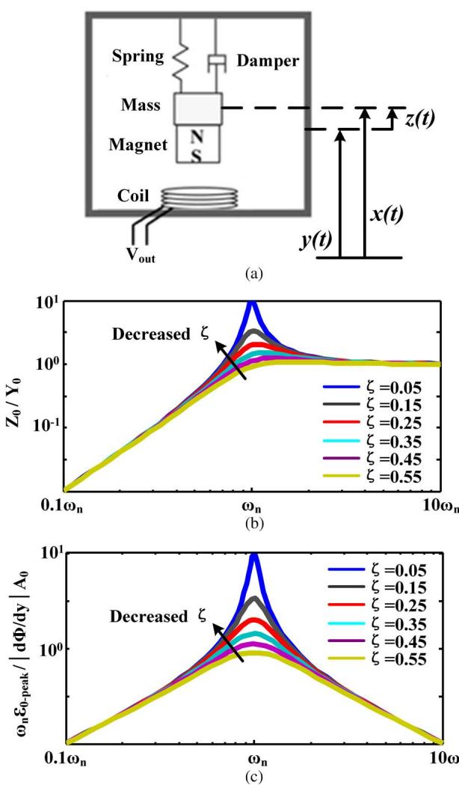
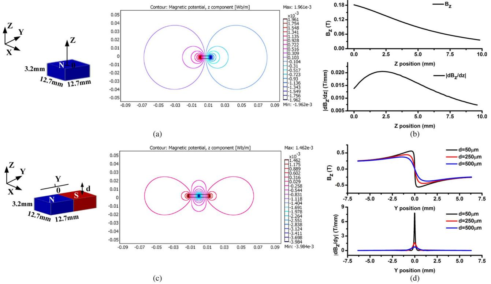
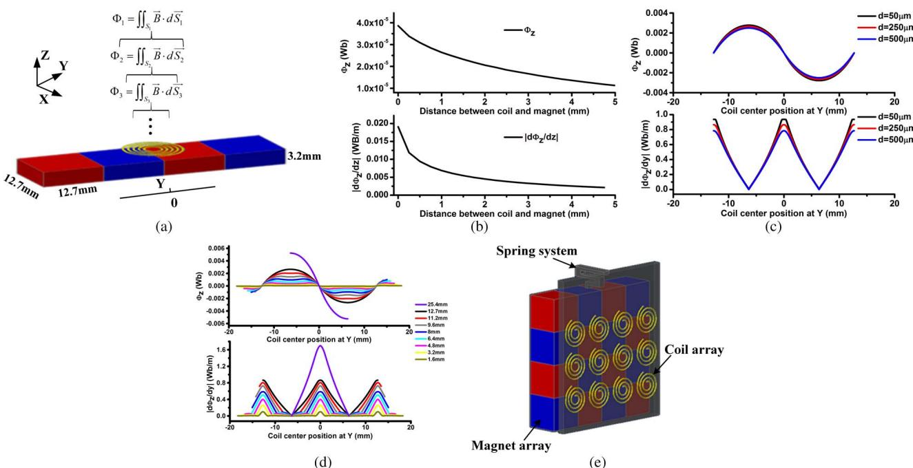
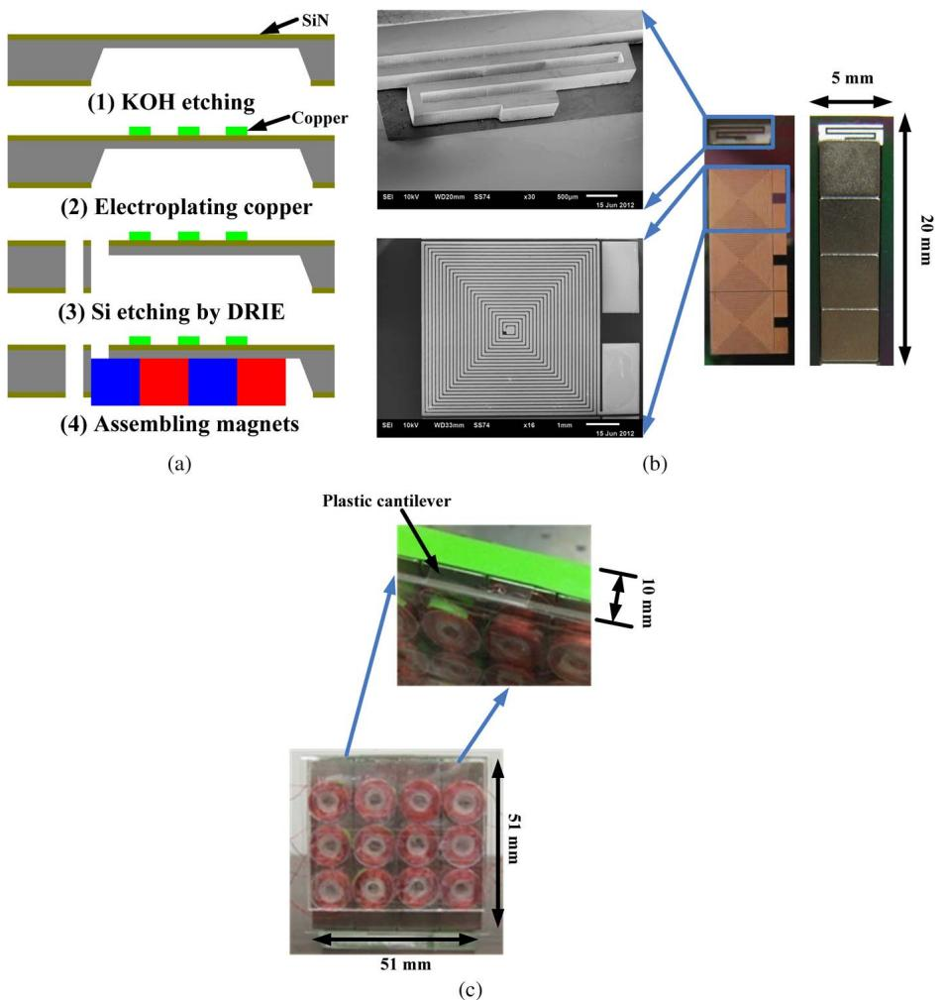
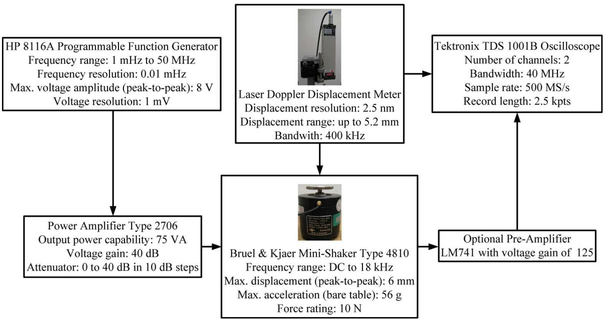
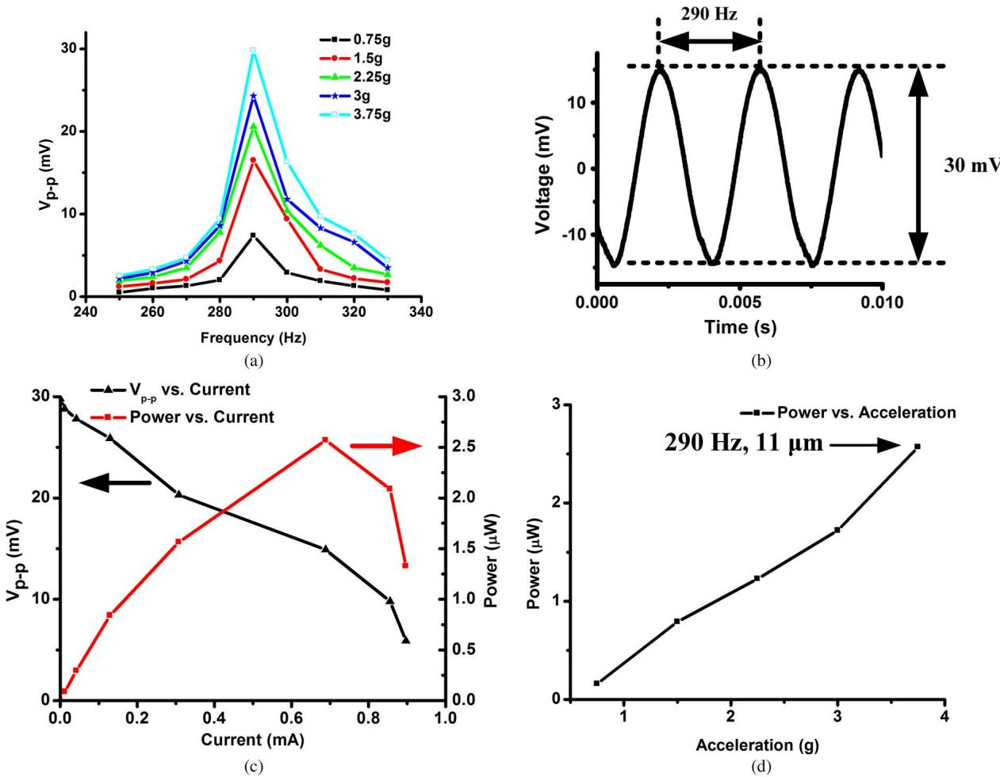
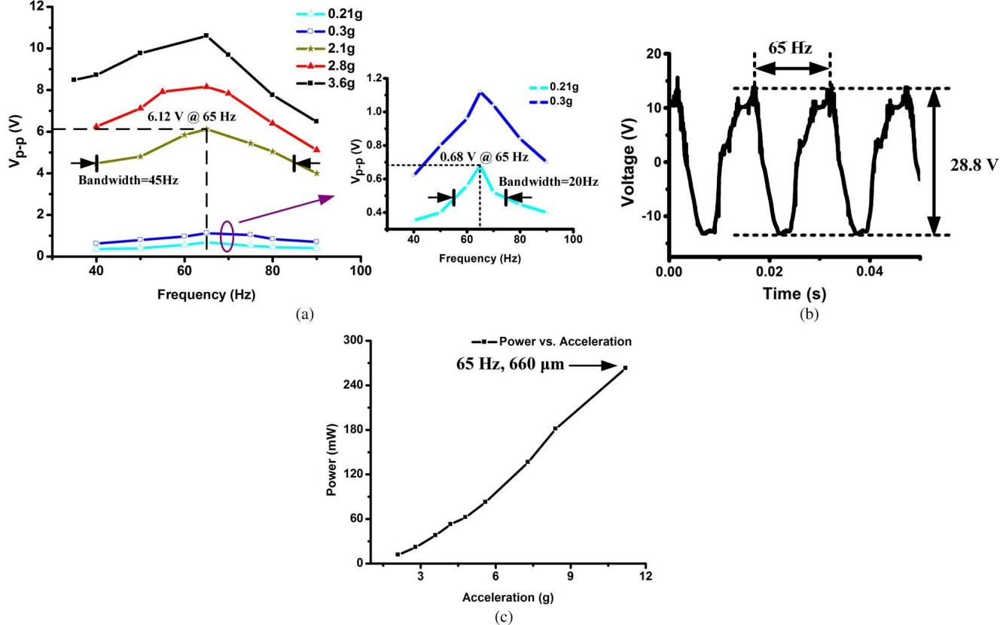
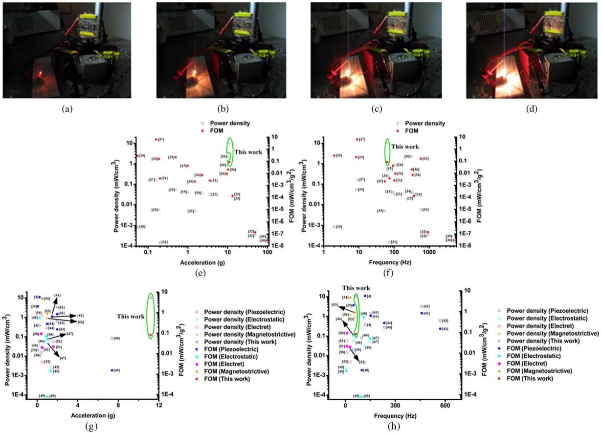

# Vibration Energy Harvesting Based on Magnet and Coil Arrays for Watt-Level Handheld Power Source

In this paper, the authors present a new energy conversion approach to convert mechanical vibrations into electrical energy with output power levels in excess of a quarter watt.

By Qian Zhang and Eun Sok Kim, Fellow IEEE

ABSTRACT | Electromagnetic energy conversion, based on Faraday’s law, can deliver a relatively large, continuous power to a low impedance load from a vibrating body. However, increasing the energy-conversion efficiency and keeping it high at a relatively large vibration amplitude have been difficult, and no miniature energy harvester has shown more than tens of milliwatt power level from submillimeter vibration amplitude. Here we provide a new energy-conversion technique to convert mechanical vibration into electrical energy with unprecedented power level of more than a quarter watt out of submillimeter vibration amplitude. The technique uses an array of alternating north- and south-orientation magnets to enhance magnetic flux change by more than an order of magnitude. A newly fabricated harvester occupying $5 1 \times 5 1 \times$ $1 0 \mathrm { m m } ^ { 3 } ( = 2 6 \mathrm { c c } )$ and weighing $_ { 9 0 \ { \mathsf { g } } }$ generates an electromotive force (EMF) of $V _ { p - p } = 2 8 . 8 ~ \mathrm { V }$ with $2 6 3 ~ \mathsf { m w }$ power output (into 96-W load) when it is vibrated at $6 5 \mathsf { H z }$ with vibration amplitude of $6 6 0 \ \mu \mathsf { m }$ . The power level is high enough to light an incandescent light bulb. Also, its microfabricated version occupying $2 0 \times 5 \times 0 . 9 \ : \mathrm { m m } ^ { 3 } \ : ( = 0 . 0 9 \ : \mathrm { c c } )$ and weighing $_ { 0 . 5 \ { \tt g } }$ generates an

EMF of $V _ { p - p } = 3 0 ~ \mathsf { m v }$ with $2 . 6 \cdot \mu \mathsf { W }$ power output (into $1 0 . 8 – \Omega$ load) when it is vibrated at ${ 2 9 0 ~ \mathsf { H z } }$ with vibration amplitude of 11 $\mu \mathsf { m }$ .

KEYWORDS | Coil array; electromagnetic induction; energy harvesting; magnet array; magnetic field distribution; vibrationdriven power generator

# I. INTRODUCTION

There has been active research for energy harvesters for a compact, light, affordable, long-lasting power source to replace and/or supplement batteries. Among many renewable energy sources, vibrations are particularly attractive due to their wide availability and potentially high power density. Converting kinetic energy (present in vibrating environment) into electrical energy with electromagnetic transduction has already been used in macroscale power generation in hydroelectric and fossil-fuel power plants as well as in wind turbines. However, microscale or miniature power generators are not widespread, mainly because the induced electromotive force (EMF) decreases rapidly as the device size scales down.

As vibration energy is ubiquitous, harvesting vibration energy to generate electrical power is well suited to power the low-power electronic devices, wireless sensors, and their networks. There are three main transduction mechanisms employed to extract energy from vibrating environment: electrostatic, piezoelectric, and electromagnetic. Each mechanism has its pros and cons. Electrostatic energy harvester generates an electrical voltage or charge through varying capacitance. Although its fabrication process can be compatible with conventional integrated circuit (IC) technologies, the capacitor needs to be initially charged with an implanted charge or an external direct current (dc) voltage source that limits its practical application [1], [2]. Piezoelectric materials can also be used for harvesting energy, as they are capable of generating a relatively highvoltage output due to mechanical strain caused by external motion. However, piezoelectric energy harvesters have high impedance, which mandates the load impedance to be high [3], [4]. Electromagnetic energy conversion, on the other hand, is advantageous due to its capability to drive a low impedance load and generate a high output current. But with decreasing device size, electromagnetic energy harvesters have had a limited success of generating a larger power level since the induced EMF rapidly reduces [5]– [10]. Although the energy harvesters have been optimized and fabricated with strong bulky magnets and wound multiturn coils, the typical output voltage is still less than $_ { 1 \textrm { V } }$ [7]–[9]. Even with stacked multilayer magnets to enhance the magnetic field [10], the power output of less than one milliwatt has been reported. Especially, for microfabricated electromagnetic energy harvesters, it is difficult to integrate a strong magnet and a low resistance coil in a planar microfabrication process. To avoid voluminous external permanent magnets, various deposition techniques such as electrodeposition, sputtering, and packing magnetic powders have been used for micromagnets in microelectromagnetic energy harvesters, but only a low-power level of $\mathrm { p W - n W }$ has been delivered [11], [12].

Even with permanent magnets, wafer-scale microelectromagnetic energy harvesters have been shown to generate less than a few microwatts [13]–[15]. A microelectromagnetic energy harvester made of a permanent magnet $( 6 \times 6 \times 6 ~ \mathrm { m m } ^ { 3 } )$ on an array of coil-containing parylene cantilevers [16] was shown to generate a maximum voltage and power of $0 . 6 7 ~ \mathrm { m V }$ and $5 6 ~ \mathrm { p W }$ , respectively, from $1 - \mu \mathrm { m }$ vibrational amplitude at $3 . 4 \ \mathrm { k H z }$ . To harvest energy from low-frequency vibrations, frequency up-conversion technique was used, with a magnet $( 3 . 8 ~ \times$ $3 . 8 \times 1 . 5 ~ \mathrm { m m } ^ { 3 }$ ) glued to a parylene diaphragm, and was shown to generate $0 . 5 7 – \mathrm { m V }$ voltage and $0 . 2 5 \mathrm { - n W }$ power from $1 . 1 \mathrm { - m m }$ vibrational amplitude at $9 5 \ \mathrm { H z }$ [17]. When a coil was patterned on a cantilever $( 2 5 \times 1 0 \times 1 ~ \mathrm { m m } ^ { 3 } )$ ) surface and a permanent magnet $( 3 0 \times 1 0 \times 6 ~ \mathrm { m m } ^ { 3 } )$ was close to the cantilever’s free end, $0 . 4 \mathrm { \ n W }$ was delivered into $1 2 8 – \Omega$ load from vibration amplitude of $0 . 6 4 ~ \mu \mathrm { m }$ a t $7 0 0 ~ \mathrm { H z }$ [18]. To reduce coil resistance, electroplating of copper was used on a silicon substrate, which was then integrated with bulk Nd–Fe–B magnets glued on Perspex chips [19]. The harvester produced a maximum power of $2 3 ~ \mathrm { n W }$ into a load resistance of $5 2 . 7 \Omega$ from $2 . 6 \mathrm { - n m }$ vibrational amplitude at $9 . 8 4 ~ \mathrm { k H z }$ .

Much higher power levels have been demonstrated with relatively large-scale electromagnetic energy harvesters. For example, an electromagnetic energy harvester (designed for scavenging traffic-induced bridge vibrations) occupying 68 cc was shown to generate a peak power of $5 7 \mu \mathrm { W }$ from $0 . 5 4 \mathrm { - m } / \mathrm { s } ^ { 2 }$ ( $\lvert 5 5 \mathrm { m g } \rvert$ acceleration at $2 \mathrm { H z }$ (about 4-mm vibration amplitude) [20]. Through optimizing the arrangement of magnets to maximize the spatial variation of magnetic flux, another electromagnetic energy harvester $( 9 . 3 { \mathrm { ~ c c } } )$ was reported to generate $2 9 0 ~ \mu \mathrm { W }$ into $7 6 { \cdot } \Omega$ load out of $3 . 6 \ \mathrm { g }$ $8 5 \mathrm { - } \mu \mathrm { m }$ vibration amplitude) at $1 0 2 ~ \mathrm { H z }$ [21]. With Nd–Fe–B magnets $\mathrm { 4 ~ m m }$ in diameter and in height) suspended by a piezoelectric bimorph, the resonant frequency of the electromagnetic energy harvester was electrically tuned through a static electric field applied to the piezoelectric bimorph, and more than $5 0 ~ \mu \mathrm { W }$ was delivered into $2 0 0 – \Omega$ load, out of $2 . 8 \AA - \mu \mathrm { m }$ vibrational amplitude, over the tunable frequency range between 265 and $3 2 5 \ \mathrm { H z }$ [22]. With two fixed magnets (volume of $\phantom { - } 0 . 8 4 \phantom { - } \mathrm { c c } ^ { \dagger }$ ) assembled on a cantilever structure that was made with traditional machining, $1 8 0 ~ \mu \mathrm { W }$ was obtained from a free-end beam displacement of $0 . 8 5 \mathrm { \ m m }$ at its resonant frequency of $3 2 2 ~ \mathrm { H z }$ [23]. Instead of letting magnet(s) to move in response to applied vibration, coil(s) can be made to vibrate, while fixing the magnet(s). A coil-moving electromagnetic generator was reported to generate output power of $4 0 0 \mu \mathrm { W }$ from 2-cm vibrational amplitude at $2 \ : \mathrm { H z }$ [24]. Now, the following summarizes various attempts to improve several aspects of electromagnetic energy harvesters. To make energy harvester planar, a copper foil was used to make planar coils to be integrated with planar spring, and an electromagnetic energy harvester was reported to deliver $1 0 . 7 \mu \mathrm { W }$ into $1 0 0 – \Omega$ load out of $2 4 . 4 \AA { \cdot } \mu \mathrm { m }$ vibration amplitude at $3 7 1 \ \mathrm { H z }$ , the fundamental resonant frequency of the harvester [25]. To lower the resonant frequency, a laser-micromachined ${ \mathrm { C u } }$ spiral spring was used to support a Nd–Fe–B permanent magnet, and an energy harvester with 1-cc volume generated $8 3 0 \mu \mathrm { W }$ from $2 0 0 \mathrm { - } \mu \mathrm { m }$ vibration amplitude at $1 1 0 ~ \mathrm { H z }$ [26]. To increase electromagnetic coupling, Halbach array was used to obtain $1 5 0 ~ \mu \mathrm { W }$ , with a $5 5 \times 5 5 \times 4 { \mathrm { - } } { \mathrm { m m } } ^ { 3 }$ harvester, from $0 . 5 – \mathrm { g }$ acceleration at $4 5 ~ \mathrm { H z }$ [27]. To reduce the manufacturing cost, printed circuit board and polymethyl methacrylate (PMMA) were used to produce a $7 – g$ harvester that generated $3 1 5 ~ \mu \mathrm { W }$ (into $1 . 2 \mathrm { - k } \Omega$ load) out of $1 \mathrm { - g }$ acceleration at $7 8 \ : \mathrm { H z }$ [28]. Though these miniature harvesters have shown orders of magnitude higher power than the microfabricated energy harvesters, they are still short of the most desirable power level of watt and beyond [29]–[37]. To compare the relative performance of the energy harvesters with different sizes under different vibration accelerations, power density in terms of power output per harvester volume $\left( \mathrm { m W } / \mathrm { c m } ^ { 3 } \right)$ and figure of merit (FOM) defined to be the $\mathrm { m W } / \mathrm { c m } ^ { 3 }$ normalized with respect to the square of acceleration $\left( \mathrm { m W } / \mathrm { c m } ^ { 3 } / \mathrm { g } ^ { 2 } \right)$ are calculated and used to compare the published electromagnetic energy harvesters (Table 1).

This paper describes a new idea to increase the energyconversion efficiency of electromagnetic transduction by orders of magnitude for vibration-driven power generator. A rapidly changing magnetic field is produced through an array of alternating north- and south-orientation magnets. Magnetic flux change for the magnet array is simulated, optimized, and compared to that for a single magnet. Based on the new idea, microfabricated and miniature electromagnetic energy harvesters with magnet and coil arrays are designed, fabricated, and demonstrated to harvest vibration energy with unprecedented conversion efficiency.

Table 1 Summary of the Reviewed Electromagnetic Power Generators   

<table><tr><td rowspan=1 colspan=1>Poweroutput(mW)</td><td rowspan=1 colspan=1>Vibrationfrequency(Hz)</td><td rowspan=1 colspan=1>Vibrationamplitude(μm)</td><td rowspan=1 colspan=1>Acceleration(g=9.81m/s²)</td><td rowspan=1 colspan=1>Volume(cm³)</td><td rowspan=1 colspan=1>Powerdensity(mW/cm²³)</td><td rowspan=1 colspan=1>FOM(mW/cm²½g²)</td><td rowspan=1 colspan=1>Reference</td></tr><tr><td rowspan=1 colspan=1>0.001</td><td rowspan=1 colspan=1>94</td><td rowspan=1 colspan=1>50</td><td rowspan=1 colspan=1>1g</td><td rowspan=1 colspan=1>0.025</td><td rowspan=1 colspan=1>0.04</td><td rowspan=1 colspan=1>0.04</td><td rowspan=1 colspan=1>[15]</td></tr><tr><td rowspan=1 colspan=1>5.6e-8</td><td rowspan=1 colspan=1>3400</td><td rowspan=1 colspan=1>1</td><td rowspan=1 colspan=1>46.5g</td><td rowspan=1 colspan=1>0.456</td><td rowspan=1 colspan=1>1.2e-7</td><td rowspan=1 colspan=1>5.7e-11</td><td rowspan=1 colspan=1>[16]</td></tr><tr><td rowspan=1 colspan=1>2.5e-7</td><td rowspan=1 colspan=1>95</td><td rowspan=1 colspan=1>1100</td><td rowspan=1 colspan=1>40g</td><td rowspan=1 colspan=1>0.15</td><td rowspan=1 colspan=1>1.7e-6</td><td rowspan=1 colspan=1>1e-9</td><td rowspan=1 colspan=1>[17]</td></tr><tr><td rowspan=1 colspan=1>4e-7</td><td rowspan=1 colspan=1>700</td><td rowspan=1 colspan=1>0.64</td><td rowspan=1 colspan=1>1.3g</td><td rowspan=1 colspan=1>0.18</td><td rowspan=1 colspan=1>2.2e-6</td><td rowspan=1 colspan=1>1.3e-6</td><td rowspan=1 colspan=1>[18]</td></tr><tr><td rowspan=1 colspan=1>2.3e-5</td><td rowspan=1 colspan=1>9840</td><td rowspan=1 colspan=1>0.0026</td><td rowspan=1 colspan=1>1g</td><td rowspan=1 colspan=1>0.11</td><td rowspan=1 colspan=1>2.1e-4</td><td rowspan=1 colspan=1>2.1e-4</td><td rowspan=1 colspan=1>[19]</td></tr><tr><td rowspan=1 colspan=1>0.057</td><td rowspan=1 colspan=1>2</td><td rowspan=1 colspan=1>4000</td><td rowspan=1 colspan=1>0.055 g</td><td rowspan=1 colspan=1>68</td><td rowspan=1 colspan=1>8.4e-4</td><td rowspan=1 colspan=1>0.277</td><td rowspan=1 colspan=1>[20]</td></tr><tr><td rowspan=1 colspan=1>0.29</td><td rowspan=1 colspan=1>102</td><td rowspan=1 colspan=1>85</td><td rowspan=1 colspan=1>3.6 g</td><td rowspan=1 colspan=1>9.3</td><td rowspan=1 colspan=1>0.031</td><td rowspan=1 colspan=1>0.0024</td><td rowspan=1 colspan=1>[21]</td></tr><tr><td rowspan=1 colspan=1>0.02356</td><td rowspan=1 colspan=1>371</td><td rowspan=1 colspan=1>24.4</td><td rowspan=1 colspan=1>13.5 g</td><td rowspan=1 colspan=1>1</td><td rowspan=1 colspan=1>0.02356</td><td rowspan=1 colspan=1>1.3e-4</td><td rowspan=1 colspan=1>[25]</td></tr><tr><td rowspan=1 colspan=1>0.83</td><td rowspan=1 colspan=1>110</td><td rowspan=1 colspan=1>200</td><td rowspan=1 colspan=1>9.7 g</td><td rowspan=1 colspan=1>1</td><td rowspan=1 colspan=1>0.83</td><td rowspan=1 colspan=1>0.009</td><td rowspan=1 colspan=1>[26]</td></tr><tr><td rowspan=1 colspan=1>2.09</td><td rowspan=1 colspan=1>8.5</td><td rowspan=1 colspan=1>172</td><td rowspan=1 colspan=1>0.5 g</td><td rowspan=1 colspan=1>40.18</td><td rowspan=1 colspan=1>0.052</td><td rowspan=1 colspan=1>0.208</td><td rowspan=1 colspan=1>[29]</td></tr><tr><td rowspan=1 colspan=1>4e-4</td><td rowspan=1 colspan=1>5000</td><td rowspan=1 colspan=1>1</td><td rowspan=1 colspan=1>100 g</td><td rowspan=1 colspan=1>1.4</td><td rowspan=1 colspan=1>2.9e-4</td><td rowspan=1 colspan=1>2.86e-8</td><td rowspan=1 colspan=1>[30]</td></tr><tr><td rowspan=1 colspan=1>4e-4</td><td rowspan=1 colspan=1>75</td><td rowspan=1 colspan=1>9</td><td rowspan=1 colspan=1>0.2 g</td><td rowspan=1 colspan=1>2.703</td><td rowspan=1 colspan=1>1.5e-4</td><td rowspan=1 colspan=1>0.0037</td><td rowspan=1 colspan=1>[31]</td></tr><tr><td rowspan=1 colspan=1>0.0032</td><td rowspan=1 colspan=1>938</td><td rowspan=1 colspan=1>14</td><td rowspan=1 colspan=1>50 g</td><td rowspan=1 colspan=1>9.504</td><td rowspan=1 colspan=1>3.4e-4</td><td rowspan=1 colspan=1>1.35e-7</td><td rowspan=1 colspan=1>[32]</td></tr><tr><td rowspan=1 colspan=1>1.5e-4</td><td rowspan=1 colspan=1>580</td><td rowspan=1 colspan=1>0.14</td><td rowspan=1 colspan=1>0.19 g</td><td rowspan=1 colspan=1>0.0271</td><td rowspan=1 colspan=1>0.0055</td><td rowspan=1 colspan=1>0.153</td><td rowspan=1 colspan=1>[33]</td></tr><tr><td rowspan=1 colspan=1>0.05</td><td rowspan=1 colspan=1>340</td><td rowspan=1 colspan=1>5</td><td rowspan=1 colspan=1>2.3 g</td><td rowspan=1 colspan=1>1.35</td><td rowspan=1 colspan=1>0.037</td><td rowspan=1 colspan=1>0.007</td><td rowspan=1 colspan=1>[34]</td></tr><tr><td rowspan=1 colspan=1>6.1e-4</td><td rowspan=1 colspan=1>55</td><td rowspan=1 colspan=1>125</td><td rowspan=1 colspan=1>1.52 g</td><td rowspan=1 colspan=1>0.13</td><td rowspan=1 colspan=1>0.0047</td><td rowspan=1 colspan=1>0.002</td><td rowspan=1 colspan=1>[35]</td></tr><tr><td rowspan=1 colspan=1>0.53</td><td rowspan=1 colspan=1>322</td><td rowspan=1 colspan=1>25</td><td rowspan=1 colspan=1>10.4g</td><td rowspan=1 colspan=1>0.24</td><td rowspan=1 colspan=1>2.2</td><td rowspan=1 colspan=1>0.02</td><td rowspan=1 colspan=1>[36]</td></tr><tr><td rowspan=1 colspan=1>1.18</td><td rowspan=1 colspan=1>9</td><td rowspan=1 colspan=1>500</td><td rowspan=1 colspan=1>0.16 g</td><td rowspan=1 colspan=1>7.39</td><td rowspan=1 colspan=1>0.16</td><td rowspan=1 colspan=1>6.24</td><td rowspan=1 colspan=1>[37]</td></tr></table>

# II. ANALYSIS OF POWER GENERATION

A vibration-driven power generator consists of a massspring system with proof mass $m$ suspended by a spring $k$ and moving within a frame as shown in Fig. 1(a). A damper $d$ incorporates any parasitic mechanical and aerodynamic damping losses. The absolute motions of the proof mass and the frame are $x ( t )$ and $y ( t )$ , respectively, while the relative displacement between the proof mass and the frame is $z ( t ) ( = x ( t ) - y ( t ) )$ . The equation of motion for the system is given by

$$
m x ( t ) ^ { \prime \prime } + d z ( t ) ^ { \prime } + k z ( t ) = 0 .
$$

For sinusoidal, steady-state vibration $y ( t ) = Y _ { 0 } \cos \omega t =$ ${ \mathrm { R e } } \{ Y _ { 0 } e ^ { j \omega t } \} , z ( t ) = Z _ { 0 } \cos ( \omega t + \theta ) = { \mathrm { R e } } \{ Z e ^ { j \omega t } \}$ , and we get

$m \omega ^ { 2 } Y _ { 0 } = - \omega ^ { 2 } m Z + j \omega d Z + k Z$ from (1). Consequently

$$
Z = \frac { m \omega ^ { 2 } Y _ { 0 } } { - \omega ^ { 2 } m + j \omega d + k } = \frac { \left( \frac { \omega } { \omega _ { n } } \right) ^ { 2 } Y _ { 0 } } { 1 - \left( \frac { \omega } { \omega _ { n } } \right) ^ { 2 } + j 2 \zeta \omega / \omega _ { n } }
$$

where $Y _ { 0 }$ is the frame’s vibration amplitude or the input vibration amplitude; $\omega _ { n } ( = \sqrt { k / m } )$ is the resonant frequency; $\omega$ is the vibration frequency; and $\zeta ( = \omega _ { n } d / 2 k )$ is the damping ratio. The magnitude $\left( Z _ { 0 } \right)$ and the phase $( \theta )$ of the relative motion are obtained from (2) as follows:

$$
Z _ { 0 } = Y _ { 0 } \frac { \left( \frac { \omega } { \omega _ { n } } \right) ^ { 2 } } { \sqrt { \left( 1 - \left( \frac { \omega } { \omega _ { n } } \right) ^ { 2 } \right) ^ { 2 } + \left( 2 \zeta \frac { \omega } { \omega _ { n } } \right) ^ { 2 } } }
$$

$$
\theta = - \tan ^ { - 1 } \frac { 2 \zeta \frac { \omega } { \omega _ { n } } } { 1 - \left( \frac { \omega } { \omega _ { n } } \right) ^ { 2 } }
$$

Fig. 1(b) shows that the relationship between $Z _ { 0 }$ and $Y _ { 0 }$ is dependent on the frequency $\omega$ and damping ratio $\zeta$ . Near the resonant frequency $\omega _ { n }$ , $Z _ { 0 }$ increases as the damping

  
Fig. 1. (a) Model of vibration-driven power generator. (b) Calculated relative displacement amplitude ${ z o }$ versus vibration frequency $\omega$ as a function of damping ratio . (c) Calculated electromotive force (EMF) at a given acceleration versus vibration frequency $\omega$ as a function of damping ratio $\zeta \cdot$

Thus, the zero-to-peak magnitude of EMF is expressed as

$$
\varepsilon _ { \mathrm { 0 - p e a k } } = \Biggl | \frac { d \varPhi } { d z } \Biggr | A _ { 0 } \frac { \frac { \omega } { \omega _ { n } ^ { 2 } } } { \sqrt { \left[ 1 - \left( \frac { \omega } { \omega _ { n } } \right) ^ { 2 } \right] ^ { 2 } + \left( 2 \zeta \frac { \omega } { \omega _ { n } } \right) ^ { 2 } } }
$$

where $A _ { 0 } = \omega ^ { 2 } Y _ { 0 }$ is the acceleration amplitude. (Note that, at a fixed acceleration, vibration amplitude $Y _ { 0 }$ is inversely proportional to the square of the vibration frequency $\omega .$ ) Thus, the EMF depends on the vibration frequency, peaking at the resonant frequency with its magnitude dependent on the damping ratio $\zeta ,$ , as shown in Fig. 1(c). At the resonant frequency, the EMF simplifies to

$$
\varepsilon _ { \mathrm { 0 - p e a k } } = \left| \frac { d \varPhi } { d z } \right| \frac { \omega _ { n } Y _ { 0 } } { 2 \zeta } = \left| \frac { d \varPhi } { d z } \right| \frac { m A _ { 0 } } { d } .
$$

For energy harvesters, maximum power outputs are delivered into matched loads of which the resistances are equal to the coil resistances. For a sinusoidal voltage wave, the power output is expressed as

$$
P _ { L } = { \frac { \left( \varepsilon _ { \mathrm { 0 - p e a k } } \right) ^ { 2 } } { 8 R } } = \left| { \frac { d \varPhi } { d z } } \right| ^ { 2 } { \frac { m ^ { 2 } A _ { 0 } ^ { 2 } } { 8 R d ^ { 2 } } }
$$

where $R$ is the load resistance that is matched to the energy harvester’s source resistance. It indicates that the power output $\left( P _ { L } \right)$ is proportional to the square of magnetic flux gradient $\left( | d \phi / d z | \right)$ , proof mass $( m )$ , and acceleration amplitude $\left( A _ { 0 } \right)$ .

ratio $\zeta$ decreases, while $Z _ { 0 }$ is close to $Y _ { 0 }$ at a frequency significantly higher than $\omega _ { n }$ .

According to Faraday’s law, the electromotive force $\varepsilon$ is proportional to the time-rate change of magnetic flux $\phi$ through a coil, and is

$$
\varepsilon = - { \frac { d { \boldsymbol { \phi } } } { d t } } = - { \frac { d { \boldsymbol { \phi } } } { d z } } { \frac { d z } { d t } } = { \frac { d { \boldsymbol { \phi } } } { d z } } \omega Z _ { 0 } \sin ( \omega t + \theta ) .
$$

Then, substitution of (3) into (5) leads to

$$
\varepsilon = \frac { d \varPhi } { d z } Y _ { 0 } \frac { \frac { \omega ^ { 3 } } { \omega _ { n } ^ { 2 } } } { \sqrt { \left[ 1 - \left( \frac { \omega } { \omega _ { n } } \right) ^ { 2 } \right] ^ { 2 } + \left( 2 \zeta \frac { \omega } { \omega _ { n } } \right) ^ { 2 } } } \mathrm { s i n } \mathopen { } \mathclose \bgroup \left( \omega t + \theta \aftergroup \egroup \right) .
$$

Consequently, magnets with larger volume (which typically provide stronger magnetic field), more coil turns, larger coil area, or larger coil cross-sectional area result in a higher power output, but increase the volume and weight. Thus, for electromagnetic energy harvesters, maximizing the spatial magnetic flux gradient $\left( | d \phi / d z | \right)$ is essential in increasing the power output as the magnets or coils move in response to the environmental vibration. For conventional electromagnetic energy harvester, the magnetic field is provided by a single magnet, and the magnetic flux change is caused by a distance change from the magnet. We have simulated the magnetic field produced by one magnet with COMSOL, and the magnetic field lines are shown in Fig. 2(a). Fig. 2(b) shows the calculated magnetic flux density $\left( B _ { z } \right)$ and its $z$ -gradient $\left( \left| d B _ { z } / d z \right| \right)$ . In order to provide a rapidly changing field, we design a new electromagnetic transduction based on an array of magnets with alternating north- and southorientation arranged on a planar surface. Fig. 2(c) and (d) shows that the change of magnetic flux density in the direction parallel to the planar surface $\left( \left| d B _ { z } / d y \right| \right)$ peaks at the boundary between two magnets, for different heights ðdÞ over the magnet surface. The simulations show that the change of magnetic flux density $\left( | d B _ { z } / d y | \right)$ for the magnet array depends on the distance from the magnet surface, and can be more than 100 times higher than that of one magnet $\left( \left| d B _ { z } / d z \right| \right)$ . Thus, the key innovation is the usages of a magnet array (along with a coil array) and the in-plane (not out-of-plane) field gradient. In the simulations and experiments, Nd–Fe–B permanent magnets (grade N52) which are the strongest commercial magnets we found at the time are used to provide the magnetic field. The parameters used in the simulations are listed in Table 2.

  
Fig. 2. (a) Cross-sectional view of the magnetic field lines produced by one magnet. (b) Magnetic flux density $\left( B _ { z } \right)$ and its gradient $( | d B _ { z } / d z | )$ from one magnet. (c) Cross-sectional view of the magnetic field lines of two-magnet array. (d) Magnetic flux density $\left( B _ { z } \right)$ and its gradient $( | \pmb { d } \pmb { B } _ { z } / \pmb { d } \pmb { \gamma } | )$ at a height of 50, 250, and 500 $\mu m$ over two-magnet array.

The magnetic flux $( \phi )$ through a multiturn coil [Fig. 3(a)] is obtained with

$$
\varPhi = \sum _ { i = 1 } ^ { n } \varPhi _ { i } = \sum _ { i = 1 } ^ { n } \left( \int _ { S _ { i } } \vec { B } \cdot d \vec { S } _ { i } \right)
$$

where $n$ is the number of coil turns; $\pmb { \phi } _ { \mathrm { i } }$ is the magnetic flux through the ith coil; B is the magnetic flux density; and $S _ { i }$ is the area of the ith coil. The magnetic flux is a numerical integral of magnetic flux density across the entire coil area. Fig. 3(b) shows the simulated magnetic flux $\left( \varPhi _ { z } \right)$ and its $z$ -gradient $\left( \left| d \Phi _ { z } / d z \right| \right)$ versus the distance between the coil and the magnet for a single magnet. Similarly, calculated magnetic flux $\left( \varPhi _ { z } \right)$ and its $y$ -gradient $\left( \left| d \Phi _ { z } / d y \right| \right)$ for an array of magnets when a coil is placed at a different position over the magnets are shown in Fig. 3(c). The $| d \phi _ { z } / d y |$ for an array of magnets peaks when the coil center is located at the boundary between the magnets; increases as the distance $( d )$ from the magnet surface is decreased; and is much higher than that for a conventional one magnet. Fig. 3(d) shows the magnetic flux $\left( \varPhi _ { z } \right)$ and its $y .$ -gradient $\left( \left| d \Phi _ { z } / d y \right| \right)$ for the coil for various diameters of the outmost coil (of the multiturn coil), showing that the magnetic flux change increases as the coil size increases. Thus, when an array of coils is placed over a magnet array, the optimal outmost diameter of the coils is equal to the side length of a magnet (if square magnets are used to form the array). Based on the simulations, we designed and fabricated various versions of the electromagnetic energy harvester illustrated in Fig. 3(e) with the magnets arranged on a planar surface such that north and south poles alternate. Coils are placed over the boundaries between the magnets, as the magnet array is suspended by a spring system providing a low spring constant in the direction parallel to the planar surface.

Table 2 Parameters Used in the Simulations   

<table><tr><td rowspan=1 colspan=1>Magnet length (mm)</td><td rowspan=1 colspan=1>12.7</td></tr><tr><td rowspan=1 colspan=1>Magnet thickness (mm)</td><td rowspan=1 colspan=1>3.2</td></tr><tr><td rowspan=1 colspan=1>Residual magnetic flux density (T)</td><td rowspan=1 colspan=1>1.48</td></tr><tr><td rowspan=1 colspan=1>Relative permeability (in vacuum environment)</td><td rowspan=1 colspan=1>1</td></tr><tr><td rowspan=1 colspan=1>Coil turn1</td><td rowspan=1 colspan=1>100</td></tr><tr><td rowspan=1 colspan=1>Coil number</td><td rowspan=1 colspan=1>1</td></tr><tr><td rowspan=1 colspan=1>Lateral space between coils (µm)</td><td rowspan=1 colspan=1>60</td></tr><tr><td rowspan=1 colspan=1>Outmost diameter of the coil&#x27; (mm)</td><td rowspan=1 colspan=1>12.7</td></tr><tr><td rowspan=1 colspan=1>Distance between the coil and magnet surface² (μm)</td><td rowspan=1 colspan=1>250</td></tr><tr><td rowspan=1 colspan=2>1For simulations when the coil is placed at different heights over the magnetarray in Fig. 3c.2For simulations when the coils with different outmost diameters are placedover the magnet array in Fig. 3d.</td></tr></table>

# III. FABRICATIONS

A microfabrication process has been used to fabricate a microelectromagnetic energy harvester with a magnet array, as shown in Fig. 4(a). First, a silicon wafer is etched from the backside by potassium hydroxide (KOH) wet etching to form low-pressure chemical vapor deposition (LPCVD) silicon–nitride microdiaphragms for front-tobackside alignment [38], followed by a second KOH etching to form $3 0 0 \mathrm { - } \mu \mathrm { m }$ deep trenches. A $\mathrm { T i } / \mathrm { C u }$ (10/ $1 0 0 \ \mathrm { n m }$ ) is deposited by E-beam evaporator as a seed layer, and then photoresist AZ4620 is spin coated and patterned to obtain a mold for the copper coil. After $2 2 \mathrm { - } \mu \mathrm { m }$ -thick copper is electroplated on the front side, the photoresist is removed in acetone, and the seed layer is etched away. Then, the silicon is etched through from the front side by silicon deep reactive ion etching (DRIE) to form a $2 0 0 \mathrm { - } \mu \mathrm { m }$ -wide twofold cantilever spring. Finally, an array of magnets is glued to the cantilever spring in the trench on the silicon backside. Photos of the fabricated microelectromagnetic energy harvester with four magnets and three coils, occupying 0.09 cc and weighing $0 . 5 \ { \mathrm { g } } ,$ are shown in Fig. 4(b). The magnets physically touch the silicon membrane, without being bonded or glued to it. Consequently, the narrow gap between the magnet array and the coil array is the silicon-membrane thickness, which is controlled easily by the KOH wet etching. In this case, a $3 0 0 \mathrm { - } \mu \mathrm { m }$ -deep trench on a $4 0 0 \mathrm { - } \mu \mathrm { m }$ -thick silicon wafer is etched by KOH wet etching to leave 100--m-thick silicon membrane, so that the gap between the magnets and coils may be $1 0 0 ~ \mu \mathrm { m }$ . The coil array on the front side of the wafer is located exactly over the boundaries between the adjacent magnets on the backside, due to the microdiaphragm-based front-to-backside alignment technique.

  
Fig. 3. (a) Calculation of magnetic flux through a multiple-turn coil. (b) Magnetic flux $( \phi _ { z } )$ and its $\pmb { z }$ -gradient $( | d \phi _ { z } / d z | )$ versus the distance between the coil and the magnet for a single magnet. (c) Magnetic flux $( \phi _ { z } )$ and its y-gradient $( | \pmb { d } \phi _ { z } / \pmb { d } \pmb { \gamma } | )$ versus the coil center position when the coil is placed at a height of 50, 250, and 500 $\mu m$ over the magnet array. (d) Magnetic flux $( \phi _ { z } )$ and its $\pmb { \gamma }$ -gradient $( | \pmb { d } \phi _ { z } / \pmb { d } \pmb { \gamma } | )$ versus the coil center position when the coils with different outmost diameters are placed at a height of 250 $\mu { \pmb m }$ over the magnet array. (e) Schematic of the energy harvester with alternating north- and south-orientation magnet array.

  
Fig. 4. (a) Brief fabrication process of the microelectromagnetic energy harvester with magnet and coil arrays. (b) Top-view and bottom-view photos of the fabricated microelectromagnetic energy harvester occupying 0.09 cc and weighing 0.5 g. (c) Perspective-view and top-view photos of the miniature energy harvester occupying 26 cc and weighing $\mathbf { \nabla } \mathbf { \mathsf { s o } } \ \mathbf { \mathsf { s } } .$ .

The miniature energy harvester has been fabricated with magnet and coil arrays using two plastic cantilevers as the spring system. We use a coil winder to wind copper wire $\mathrm { ' 0 . 1 2 7 ~ m m }$ in diameter) around a laser-machined acrylic spool to form a 200-turn coil. Twelve such coils are mounted on a plastic plate, which is connected to a $2 5 0 – \mu \mathrm { m }$ -thick plastic beam at the top as well as at the bottom. The thin beams are then connected to a 16-magnet array such that the beams suspend the magnet array with an air gap (about $2 5 0 ~ \mu \mathrm { m }$ wide) between the magnet array and the coil array. Photos of the fabricated miniature energy harvester with 16 magnets and 12 coils, occupying $2 6 \ \mathrm { c c }$ and weighing $9 0 \ { \ g } .$ , are shown in Fig. 4(c). The two suspension beams at the top and bottom, rather than just in one place, are used to make the vibration direction of the proof mass (for example, the magnet array in this design) more parallel to the coil plate so that the energy lost due to the hitting of magnets and coils is reduced. The thin plastic beam also provides a low spring constant as well as a sturdy support for a relatively heavy magnet array, and facilitates a low resonant frequency, making the energy harvesters work at a wide frequency range of input acceleration. The detailed parameters of the fabricated microelectromagnetic and miniature energy harvesters are listed in Tables 3 and 4, respectively.

Table 3 Parameters of the Microfabricated Energy Harvester   

<table><tr><td rowspan=1 colspan=1>Total volume (mm³)</td><td rowspan=1 colspan=1>20 × 5 × 0.9 (0.09 cc)</td></tr><tr><td rowspan=1 colspan=1>Weight (g)</td><td rowspan=1 colspan=1>0.5</td></tr><tr><td rowspan=1 colspan=1>Magnet size (mm³)</td><td rowspan=1 colspan=1>4.8 × 4.8 × 0.8</td></tr><tr><td rowspan=1 colspan=1>Coil thickness (μm)</td><td rowspan=1 colspan=1>22</td></tr><tr><td rowspan=1 colspan=1>Coil turn</td><td rowspan=1 colspan=1>20</td></tr><tr><td rowspan=1 colspan=1>Coil resistance (Ω)</td><td rowspan=1 colspan=1>3.6</td></tr><tr><td rowspan=1 colspan=1>Coil number</td><td rowspan=1 colspan=1>3</td></tr><tr><td rowspan=1 colspan=1>Gap between magnet array and coil array (μm)</td><td rowspan=1 colspan=1>100</td></tr></table>

# IV. MEASUREMENTS AND DISCUSSION

# A. Test Setup

The fabricated electromagnetic energy harvesters are characterized with a vibration shaker system, which includes a function generator, a power amplifier, a shaker table, a preamplifier, a laser Doppler displacement meter (LDDM), and an oscilloscope, as shown in Fig. 5. The shaker table provides vibration, while the function generator controls the vibration frequency and amplitude. The vibration amplitude is measured with the LDDM, while the EMF from the power generator is observed at the oscilloscope.

# B. Measurements of Microfabricated Electromagnetic Energy Harvester

For the microfabricated electromagnetic energy harvester with four magnets and three coils, the measured EMFs as a function of vibration frequency at various input accelerations are shown in Fig. 6(a) when three coils are connected in series. At a fixed acceleration, the EMFs depend on the vibration frequency, peaking at the resonant frequency. From the acceleration of $3 . 7 5 \ \mathrm { g }$ at the resonant frequency of ${ 2 9 0 } \mathrm { H z }$ , a peak value of $3 0 \mathrm { m V }$ peak-to-peak is measured as shown in Fig. 6(b). Fig. 6(c) shows the measured output voltage and power across a load resistor with different resistances, at the acceleration of $3 . 7 5 \mathrm { g }$ . The load resistor is directly connected to the fabricated energy harvester, and the voltage across the load resistor is amplified by a preamplifier and the amplified waveform is observed at the oscilloscope. Thus, the unamplified voltage across the load resistor produced by the energy harvester is the amplified voltage divided by the gain of the preamplifier. As we vary the resistance of the load resistor, the waveforms of the output voltages are recorded for each resistance value. With the root-mean-square (rms) values of the voltages that are obtained from the waveforms, the power outputs delivered to the loads of various resistances are calculated. A maximum power of $2 . 6 ~ \mu \mathrm { W }$ is delivered to a $1 0 . 8 – \Omega$ load from the $3 . 7 5 \mathrm { - g }$ acceleration at vibration frequency of ${ 2 9 0 ~ \mathrm { H z } }$ . The power output (into $1 0 . 8 – \Omega$ load) at a resonant frequency of the microelectromagnetic energy harvester as a function of the vibration acceleration is shown in Fig. 6(d). As the acceleration is increased from 0.75 to $3 . 7 5 \ \mathrm { g } \cdot$ , the maximum power output increases from

Table 4 Parameters of the Fabricated Miniature Energy Harvester   

<table><tr><td rowspan=1 colspan=1>Total volume (mm³)</td><td rowspan=1 colspan=1>51 × 51 × 10 (26 cc)</td></tr><tr><td rowspan=1 colspan=1>Weight (g)</td><td rowspan=1 colspan=1>90</td></tr><tr><td rowspan=1 colspan=1>Magnet size (mm³)</td><td rowspan=1 colspan=1>12.7 × 12.7 × 3.2</td></tr><tr><td rowspan=1 colspan=1>Cross-sectional diameter (mm)</td><td rowspan=1 colspan=1>0.127</td></tr><tr><td rowspan=1 colspan=1>Coil turn</td><td rowspan=1 colspan=1>200</td></tr><tr><td rowspan=1 colspan=1>Coil resistance (Ω)</td><td rowspan=1 colspan=1>8</td></tr><tr><td rowspan=1 colspan=1>Coil number</td><td rowspan=1 colspan=1>12</td></tr><tr><td rowspan=1 colspan=1>Gap between magnet array and coil array (μm)</td><td rowspan=1 colspan=1>250</td></tr><tr><td rowspan=1 colspan=1>Acrylic spool size (mm)</td><td rowspan=1 colspan=1>Outside diameter=12.7Inner diameter=3.5Height=1.5</td></tr><tr><td rowspan=1 colspan=1>Plastic cantilever size (mm³)</td><td rowspan=1 colspan=1>18 × 10 × 0.25</td></tr></table>

  
Fig. 5. Experimental test setup to characterize the fabricated electromagnetic power generators.

0.2 to $2 . 6 ~ \mu \mathrm { W }$ . The $3 . 7 5 \ \mathrm { g }$ of acceleration at ${ 2 9 0 ~ \mathrm { H z } }$ corresponds to about $1 1 \mathrm { - } \mu \mathrm { m }$ vibration amplitude, and the microelectromagnetic energy harvester can harvest some very small vibrations that exist in walls, bridges, etc. However, in practical applications, the harvested power level may differ from the one measured with a monofrequency sinusoidal vibration source, even for a same vibration amplitude, since the frequency spectrum of a practical vibration source is typically broadband (unlike the one produced by the mechanical shaker used in the current experiments that produces a monofrequency sinusoidal vibration) and because a vibration-driven energy harvester produces the maximum power at its resonant frequency.

# C. Measurements of Miniature Electromagnetic Energy Harvester

Based on the same conversion principle, a miniature energy harvester scaled up to 16 magnets and 12 coils occupying $2 6 \thinspace \mathrm { c c }$ and weighing $9 0 \mathrm { g }$ has been fabricated and characterized. The preamplifier is not needed in this case, since the output voltage from the miniature energy harvester is very large. The measured EMFs as a function of vibration frequency at various input accelerations are shown in Fig. 7(a) when 12 coils are connected in series. At a fixed acceleration, the EMFs depend on the vibration frequency, peaking at the resonant frequency. Among the various versions of the fabricated energy harvesters, the miniature energy harvester with 16 magnets and 12 coils has shown to have the best performance, generating an EMF of $2 8 . 8 \mathrm { ~ V ~ }$ peak-to-peak at $6 5 ~ \mathrm { H z }$ when the vibration amplitude is $6 6 0 \mu \mathrm { m }$ , as shown in Fig. 7(b). The measured plot of EMF versus vibration frequency for an input acceleration of $_ { 0 . 2 1 \mathrm { g } }$ at the resonant frequency of $6 5 ~ \mathrm { H z }$ [Fig. 7(a)] shows a 3-dB bandwidth $( \varDelta \omega )$ of $2 0 ~ \mathrm { H z }$ , and a quality factor ðQÞ can be estimated to be 3.25, as $Q = \omega _ { n } /$ $\varDelta \omega$ . Thus, the damping ratio is $\zeta = \omega _ { n } d / 2 k = 1 / 2 Q =$ 0:15. At the acceleration of $2 . 1 \mathrm { g }$ , the quality factor ðQÞ is reduced to 1.44 with the 3-dB bandwidth $( \varDelta \omega )$ of $4 5 ~ \mathrm { H z }$ , and the corresponding damping ratio is $\zeta = 1 / 2 Q =$ 0:35. As the input acceleration increases, the damping ratio increases, indicating the decreasing energy-conversion efficiency. The power output (into $9 6 { \cdot } \Omega$ load) at a resonant frequency of the energy harvester as a function of the vibration acceleration is shown in Fig. 7(c). As the acceleration is increased from 2.1 to $ 1 1 . 2 \ \mathrm { g } ;$ , the miniature energy harvester delivers power output to $9 6 { \cdot } \Omega$ load from 11.7 to $2 6 3 ~ \mathrm { m W }$ . As far as we know, this is a record power level, by far, for this kind of volume and weight.

When we connect the energy harvester to a $^ { * } 0 . 1 2 \ – \mathrm { W }$ 0.06-A 2-V’’ incandescent light bulb directly, the harvested power level is so high that it can light the bulb to a level close to burning out its filament. Fig. 8(a)–(d) shows the light bulb being lit up by the energy harvester as the input acceleration at $6 5 \ : \mathrm { H z }$ is increased from 5.6 to 7.5, 9.5, and then $1 1 . 2 \textrm { g }$ (corresponding to $6 6 0 – \mu \mathrm { m }$ vibration amplitude). With increasing acceleration (or vibration amplitude), the light intensity from the bulb increases, and a very bright light is emitted [Fig. 8(d)], as the power harvested at a higher acceleration exceeds the bulb’s full capacity. As far as we know, this is the first demonstration of an incandescent light bulb (not light-emitting diode) being lit up by an energy harvester.

  
Fig. 6. Microfabricated electromagnetic energy harvester occupying 0.09 cc and weighing $\pmb { o . 5 8 } .$ (a) Measured EMF (peak-to-peak value) versus vibration frequency at different accelerations. (b) Measured EMF of 30 mV peak-to-peak at 290 Hz in response to a vibration amplitude of 11 $\mu { \pmb m } ,$ . (c) Measured output voltage (peak-to-peak value) and power across a load resistor with different resistances at the acceleration of $\pmb { 3 . 7 5 \mathrm { g . } }$ (d) Measured power output (into 10.8-W load) versus input acceleration.

We compare the newly developed energy harvester with various electromagnetic energy harvesters reported in literature and show power density $\left( \mathrm { m W } / \mathrm { c m } ^ { 3 } \right)$ and FOM $( \mathrm { m W } / \mathrm { c m } ^ { 3 } / \mathrm { g } ^ { 2 } )$ in Fig. 8(e) and (f) for various input accelerations and vibration frequencies, respectively. The FOM typically drops as the input acceleration increases, as shown in Fig. 8(e), indicating that it is difficult to generate high power with high efficiency, since the increasing acceleration causes larger damping. As can be seen in Fig. 8(e) and (f), our energy harvester produced the highest power output $( 2 6 3 \mathrm { m W } )$ and highest power density $( 1 0 . 1 2 \mathrm { m W } / \mathrm { c m } ^ { 3 } )$ , by orders of magnitude, and showed the best FOM $( 0 . 0 8 1 \mathrm { m W } / \mathrm { c m } ^ { 3 } / \mathrm { g } ^ { 2 } )$ , among the energy harvesters reported in literature. The energy harvester based on the new ideas is orders of magnitude better than any reported energy harvester.

Fig. $8 ( \ g )$ and $\mathrm { { ( h ) } }$ shows the power density $\mathrm { ( m W / c m ^ { 3 } } \mathrm { ) }$ ) and FOM $( \mathrm { m W } / \mathrm { c m } ^ { 3 } / \mathrm { g } ^ { 2 } )$ of other types of vibration-driven energy harvesters, including piezoelectric [4], [39]–[44], electrostatic [45]–[49], electret [50]–[52], and magnetostrictive types [53], [54], for various input accelerations and vibration frequencies, respectively. The important parameters for these energy harvesters are listed in Table 5. Piezoelectric method produces relatively high power density and FOM at high vibration frequency with highly piezoelectric material (such as lead zirconate titanate). But since the piezoelectric materials need to be strained to generate electricity, the vibration amplitude and lifetime are limited. Electrostatic energy harvesters that require an external polarization voltage or an implanted charge show the lowest power density and FOM, even though their sizes are typically small. In addition, mechanical constraints for the moving electrodes need to be carefully designed to control the small vibration displacement. Magnetostrictive materials (which deform when placed in a magnetic field, or inversely induce a change of magnetic field upon deformation) can be used independently [53] or in piezoelectric–magnetostrictive composites [54] for energy harvesting. This method still needs to overcome the challenges of limited film thickness and nonlinear effects. Although piezoelectric–magnetostrictive composites show a higher power density, relative motion between an external magnet and the composites has not been realized on a vibrating surface.

  
Fig. 7. Measured performance of the miniature energy harvester (based on the same conversion principle) occupying 26 cc and weighing 90 g. (a) Measured EMF (peak-to-peak value) versus vibration frequency at different accelerations. (b) Measured EMF of 28.8 V peak-to-peak at 65 Hz in response to a vibration amplitude of 660 $\mu { \pmb m } .$ . (c) Measured power output (into 96-W load) versus input acceleration.

# D. Energy-Conversion Efficiency

The instantaneous mechanical power that a vibrating surface has, before an energy harvester is loaded, is

$$
P _ { i } ( t ) = - M y _ { i } ( t ) ^ { \prime \prime } y _ { i } ( t ) ^ { \prime }
$$

where $M$ and $y _ { i } ( t )$ are the mass of the vibrating surface and the vibration displacement of the vibrating body itself without an energy harvester, respectively. Since the kinetic momentum is $M y _ { i } ( t ) ^ { \prime }$ before an energy harvester is loaded and because the harvester adds the mass of the proof mass $m$ and other auxiliary mass $m _ { h }$ to $M$ , we have $M y _ { i } ( t ) ^ { \prime } = ( M + m + m _ { h } ) y ( t ) ^ { \prime }$ from conservation of kinetic momentum, and we obtain, in terms of

$Y _ { 0 }$ (the vibration amplitude with the harvester having $m + m _ { h }$ mass)

$$
P _ { i } ( t ) = \frac { ( M + m + m _ { h } ) ^ { 2 } } { M } \omega ^ { 3 } Y _ { 0 } ^ { 2 } \cos ( \omega t ) \sin ( \omega t ) .
$$

The maximum instantaneous mechanical power (that a vibrating surface has before an energy harvester is loaded), in terms of $Y _ { 0 }$ (the vibration amplitude after the harvester is loaded), is

$$
P _ { i , \operatorname* { m a x } } ( t ) = \frac { ( M + m + m _ { h } ) ^ { 2 } } { 2 M } \omega ^ { 3 } Y _ { 0 } ^ { 2 } .
$$

With $p _ { e , \mathrm { m a x } }$ defined to be the maximum instantaneous electrical power, the overall energy-conversion efficiency (ECE) is obtained by

$$
\mathrm { E C E } = \frac { P _ { e , \mathrm { m a x } } } { P _ { \mathrm { i , m a x } } } .
$$

  
Fig. 8. Measured performance of the miniature energy harvester occupying 26 cc and weighing 90 g. Photos of an incandescent light bulb being lit up by the energy harvester at input accelerations of (a) $\pmb { 5 . 6 } \pmb { \mathrm { g } }$ (corresponding to 330- $_ { ; \mu m }$ vibration amplitude), (b) 7.5 g (440- $_ { ; \mu m }$ vibration amplitude), (c) 9.5 g (560- $_ { ; \mu m }$ vibration amplitude), and (d) 11.2 g (660- $_ { ; \mu m }$ vibration amplitude). (e) Power output per harvester volume and FOM versus input acceleration for various published electromagnetic energy harvesters. (f) Power output per harvester volume and FOM versus vibration frequency for various published electromagnetic energy harvesters. (g) Power output per harvester volume and FOM versus input acceleration for various published vibration-driven energy harvesters. (h) Power output per harvester volume and FOM versus vibration frequency for various published vibration-driven energy harvesters.

Thus, the theoretical ECE of an electromagnetic energy harvester is

$6 5 ~ \mathrm { H z }$ under $1 1 . 2 – \mathrm { g }$ acceleration can be calculated from (16) as

$$
\mathrm { E C E } = \frac { 2 M } { \left( M + m + m _ { h } \right) ^ { 2 } } \frac { P _ { e , \mathrm { m a x } } } { \omega ^ { 3 } Y _ { 0 } ^ { 2 } } .
$$

For a given mass of an energy harvester $\left( m + m _ { h } \right)$ , the ECE is maximized when $M = m + m _ { h }$ , and the maximum ECE is equal to

$$
\begin{array} { r l } & { \mathrm { C E } _ { \mathrm { m a x } } } \\ & { \quad = \frac { P _ { e , \mathrm { m a x } } } { 2 M \omega ^ { 3 } Y _ { 0 } ^ { 2 } } } \\ & { \quad = \frac { \left( 2 8 . 8 \right) ^ { 2 } / 9 6 } { 2 \times 9 0 \times 1 0 ^ { - 3 } \times \left( 2 \pi \times 6 5 \right) ^ { 3 } \times \left( 0 . 6 6 \times 1 0 ^ { - 3 } \right) ^ { 2 } } } \\ & { \quad = 1 0 \% . } \end{array}
$$

$$
\mathrm { E C E } _ { \operatorname* { m a x } } = \frac { P _ { e , \operatorname* { m a x } } } { 2 M \omega ^ { 3 } Y _ { 0 } ^ { 2 } } .
$$

Thus, the maximum ECE for the miniature energy harvester weighing $9 0 \textrm { g }$ at the resonant frequency of

As can be seen in Fig. 7(a), the damping ratio increases as the input acceleration is increased. At the acceleration of $2 . 1 \ \mathrm { g }$ , the maximum ECE increases to $1 3 \%$ , 1.3 times higher than that at the acceleration of $_ { \mathrm { ~ 1 1 . 2 ~ g ~ } }$ . The maximum ECE for the microfabricated energy harvester can be estimated in the same way.

Table 5 Summary of the Reviewed Piezoelectric [4], [39]–[44], Electrostatic [45]–[49], Electret [50]–[52], and Magnetostrictive [53], [54] Power Generators   

<table><tr><td rowspan=1 colspan=1>Poweroutput(mW)</td><td rowspan=1 colspan=1>Vibrationfrequency(Hz)</td><td rowspan=1 colspan=1>Vibrationamplitude(μm)</td><td rowspan=1 colspan=1>Acceleration(g=9.81m/s²)</td><td rowspan=1 colspan=1>Volume(cm²)</td><td rowspan=1 colspan=1>Powerdensity(mW/cm³)</td><td rowspan=1 colspan=1>FOM(mW/cm²/g²)</td><td rowspan=1 colspan=1>Reference</td></tr><tr><td rowspan=1 colspan=1>0.375</td><td rowspan=1 colspan=1>120</td><td rowspan=1 colspan=1>4.4</td><td rowspan=1 colspan=1>0.26g</td><td rowspan=1 colspan=1>1</td><td rowspan=1 colspan=1>0.375</td><td rowspan=1 colspan=1>5.55</td><td rowspan=1 colspan=1>[4]</td></tr><tr><td rowspan=1 colspan=1>0.18</td><td rowspan=1 colspan=1>50</td><td rowspan=1 colspan=1>10</td><td rowspan=1 colspan=1>0.1g</td><td rowspan=1 colspan=1>9</td><td rowspan=1 colspan=1>0.02</td><td rowspan=1 colspan=1>2</td><td rowspan=1 colspan=1>[39]</td></tr><tr><td rowspan=1 colspan=1>0.0163</td><td rowspan=1 colspan=1>100</td><td rowspan=1 colspan=1>184</td><td rowspan=1 colspan=1>7.4g</td><td rowspan=1 colspan=1>0.2</td><td rowspan=1 colspan=1>0.0815</td><td rowspan=1 colspan=1>0.0015</td><td rowspan=1 colspan=1>[40]</td></tr><tr><td rowspan=1 colspan=1>0.205</td><td rowspan=1 colspan=1>154</td><td rowspan=1 colspan=1>15.7</td><td rowspan=1 colspan=1>1.5g</td><td rowspan=1 colspan=1>0.15</td><td rowspan=1 colspan=1>1.37</td><td rowspan=1 colspan=1>0.61</td><td rowspan=1 colspan=1>[41]</td></tr><tr><td rowspan=1 colspan=1>0.00215</td><td rowspan=1 colspan=1>461</td><td rowspan=1 colspan=1>2.3</td><td rowspan=1 colspan=1>2g</td><td rowspan=1 colspan=1>6.6e-4</td><td rowspan=1 colspan=1>3.27</td><td rowspan=1 colspan=1>0.82</td><td rowspan=1 colspan=1>[42]</td></tr><tr><td rowspan=1 colspan=1>0.06</td><td rowspan=1 colspan=1>572</td><td rowspan=1 colspan=1>1.5</td><td rowspan=1 colspan=1>2g</td><td rowspan=1 colspan=1>0.1</td><td rowspan=1 colspan=1>0.6</td><td rowspan=1 colspan=1>0.15</td><td rowspan=1 colspan=1>[43]</td></tr><tr><td rowspan=1 colspan=1>0.014</td><td rowspan=1 colspan=1>235</td><td rowspan=1 colspan=1>4.5</td><td rowspan=1 colspan=1>1g</td><td rowspan=1 colspan=1>0.05</td><td rowspan=1 colspan=1>0.28</td><td rowspan=1 colspan=1>0.28</td><td rowspan=1 colspan=1>[44]</td></tr><tr><td rowspan=1 colspan=1>0.036</td><td rowspan=1 colspan=1>6</td><td rowspan=1 colspan=1>9000</td><td rowspan=1 colspan=1>1.3g</td><td rowspan=1 colspan=1>15</td><td rowspan=1 colspan=1>0.00242</td><td rowspan=1 colspan=1>0.00143</td><td rowspan=1 colspan=1>[45]</td></tr><tr><td rowspan=1 colspan=1>1.052</td><td rowspan=1 colspan=1>50</td><td rowspan=1 colspan=1>90</td><td rowspan=1 colspan=1>0.9g</td><td rowspan=1 colspan=1>18</td><td rowspan=1 colspan=1>0.058</td><td rowspan=1 colspan=1>0.072</td><td rowspan=1 colspan=1>[46]</td></tr><tr><td rowspan=1 colspan=1>0.0022</td><td rowspan=1 colspan=1>150</td><td rowspan=1 colspan=1>11</td><td rowspan=1 colspan=1>1g</td><td rowspan=1 colspan=1>0.042</td><td rowspan=1 colspan=1>0.052</td><td rowspan=1 colspan=1>0.052</td><td rowspan=1 colspan=1>[47]</td></tr><tr><td rowspan=1 colspan=1>0.0013</td><td rowspan=1 colspan=1>110</td><td rowspan=1 colspan=1>5.1</td><td rowspan=1 colspan=1>0.25g</td><td rowspan=1 colspan=1>0.038</td><td rowspan=1 colspan=1>0.034</td><td rowspan=1 colspan=1>0.547</td><td rowspan=1 colspan=1>[48]</td></tr><tr><td rowspan=1 colspan=1>1.5e-4</td><td rowspan=1 colspan=1>96</td><td rowspan=1 colspan=1>27</td><td rowspan=1 colspan=1>1g</td><td rowspan=1 colspan=1>1.86</td><td rowspan=1 colspan=1>8.1e-5</td><td rowspan=1 colspan=1>8.1e-5</td><td rowspan=1 colspan=1>[49]</td></tr><tr><td rowspan=1 colspan=1>0.006</td><td rowspan=1 colspan=1>10</td><td rowspan=1 colspan=1>1000</td><td rowspan=1 colspan=1>0.4g</td><td rowspan=1 colspan=1>0.4</td><td rowspan=1 colspan=1>0.015</td><td rowspan=1 colspan=1>0.09375</td><td rowspan=1 colspan=1>[50]</td></tr><tr><td rowspan=1 colspan=1>0.0025</td><td rowspan=1 colspan=1>10</td><td rowspan=1 colspan=1>4000</td><td rowspan=1 colspan=1>1.6g</td><td rowspan=1 colspan=1>0.044</td><td rowspan=1 colspan=1>0.057</td><td rowspan=1 colspan=1>0.022</td><td rowspan=1 colspan=1>[51]</td></tr><tr><td rowspan=1 colspan=1>0.0015</td><td rowspan=1 colspan=1>28</td><td rowspan=1 colspan=1>158</td><td rowspan=1 colspan=1>0.5g</td><td rowspan=1 colspan=1>0.3</td><td rowspan=1 colspan=1>0.005</td><td rowspan=1 colspan=1>0.02</td><td rowspan=1 colspan=1>[52]</td></tr><tr><td rowspan=1 colspan=1>0.576</td><td rowspan=1 colspan=1>58</td><td rowspan=1 colspan=1>73.9</td><td rowspan=1 colspan=1>1g</td><td rowspan=1 colspan=1>0.95</td><td rowspan=1 colspan=1>0.606</td><td rowspan=1 colspan=1>0.606</td><td rowspan=1 colspan=1>[53]</td></tr><tr><td rowspan=1 colspan=1>1.2</td><td rowspan=1 colspan=1>30</td><td rowspan=1 colspan=1>138</td><td rowspan=1 colspan=1>0.5g</td><td rowspan=1 colspan=1>1</td><td rowspan=1 colspan=1>1.2</td><td rowspan=1 colspan=1>4.8</td><td rowspan=1 colspan=1>[54]</td></tr></table>

# V. CONCLUSION

This paper presents a new technique of converting mechanical energy to electrical energy that can be used to harvest $\mathrm { m W - W }$ power level from a vibrating surface of tens to hundreds of micrometers amplitude. An array of magnets with alternating north- and south-orientation arranged on a planar surface is utilized in both microfabricated and miniature electromagnetic energy harvesters to provide a rapidly changing magnetic field. Experimental results show that a microfabricated energy harvester of $2 0 \times 5 \times 0 . 9 \mathrm { m m } ^ { 3 }$ $\left( = 0 . 0 9 \mathrm { c c } \right)$ weighing $0 . 5 \mathrm { g }$ generates an induced EMF of $V _ { \mathrm { p - p } } = 3 0 ~ \mathrm { m V }$ with $2 . 6 \AA \mathrm { / / } \mu \mathrm { W }$ power output (into $1 0 . 8 – \Omega$ load) when it is vibrated at ${ 2 9 0 ~ \mathrm { H z } }$ with vibration amplitude of 11 $\mu \mathrm { m }$ . Its miniature version, which is scaled up to $5 1 \times 5 1 \times 1 0 \mathrm { m m } ^ { 3 }$ $= 2 6 \mathrm { c c }$ ) weighing $9 0 \textrm { \text g } _ { \mathrm { { s } } }$ generates an EMF of $V _ { \mathrm { p - p } } = ~ 2 8 . 8 \mathrm { ~ V ~ }$ with $2 6 3 \mathrm { - m W }$ power output (into $9 6 { \cdot } \Omega$ load) when it is vibrated at $6 5 ~ \mathrm { H z }$ with vibration amplitude of $6 6 0 ~ \mu \mathrm { m }$ . The high-power level allows us to light an incandescent light bulb (which requires much larger power than a light-emitting diode) with a single energy harvester for the first time. For the miniature energy harvester having a total mass of $9 0 ~ \mathrm { g }$ and a resonant frequency of $6 5 ~ \mathrm { H z }$ under $1 1 . 2 \mathrm { - g }$ acceleration, the ECE peaks at $1 0 \%$ when the mass of the vibrating surface is equal to $9 0 ~ \mathrm { g }$ . These results from microfabricated and miniature versions show a great prospect of the new electromagnetic energy-conversion idea in harvesting vibration energy and also in generating power. The resonant frequency can be adjusted through design modification of the spring system to harvest electrical power from various vibrating environments, and scaling up the number of magnets and coils is an easy way to increase the power. h

# REFERENCES

[1] S. Meninger, J. O. Mur-Miranda, R. Amirtharajah, A. P. Chandrakasan, and J. H. Lang, ‘‘Vibration-to-electric energy conversion,’’ IEEE Trans. Very Large Scale Integr. (VLSI) Syst., vol. 9, no. 1, pp. 64–76, Jan. 2001.   
[2] D. Hoffmann, B. Folkmer, and Y. Manoli, ‘‘Analysis and characterization of triangular electrode structures for electrostatic energy harvesting,’’ $J .$ Micromech. Microeng., vol. 21, 2011, 104002.   
[3] S. P. Beeby, A. Blackburn, and N. M. White, ‘‘Processing of PZT piezoelectric thick films on silicon for microelectromechanical systems,’’ J. Micromech. Microeng., vol. 9, pp. 218–229, 1999.   
[4] S. Roundy and P. K. Wright, ‘‘A piezoelectric vibration based generator for wireless electronics,’’ Smart Mater. Struct., vol. 13, pp. 1131–1142, 2004.   
[5] D. P. Arnold, ‘‘Review of microscalemagnetic power generation,’’ IEEE Trans. Magn., vol. 43, no. 11, pp. 3940–3951, Nov. 2007.   
[6] S. P. Beeby et al., ‘‘A comparison of power output from linear and nonlinear kinetic energy harvesters using real vibration data,’’ Smart Mater. Struct., vol. 22, 2013, 075022.   
[7] S. P. Beeby, M. J. Tudor, and N. M. White, ‘‘Energy harvesting vibration sources for microsystems applications,’’ Meas. Sci. Technol., vol. 17, pp. R175–R195, 2006.   
[8] E. Bouendeu, A. Greiner, P. J. Smith, and J. G. Korvink, ‘‘Design synthesis of electromagnetic vibration-driven energy generators using a variational formulation,’ J. Microelectromech. Syst., vol. 20, no. 2, pp. 466–475, Apr. 2011.   
[9] S. P. Beeby et al., ‘‘A micro electromagnetic generator for vibration energy harvesting,’’ J. Micromech. Microeng., vol. 17, pp. 1257–1265, 2007.   
[10] S. D. Kwon, J. Park, and K. Law, ‘‘Electromagnetic energy harvester with repulsively stacked multilayer magnets for low frequency vibrations,’’ Smart Mater. Struct., vol. 22, 2013, 055007.   
[11] Y. Jiang et al., ‘‘Fabrication of a vibration-driven electromagnetic energy harvester with integrated NdFeB/Ta multilayered micro-magnets,’’ J. Micromech. Microeng., vol. 21, 2011, 095014.   
[12] Q. Zhang, S. J. Chen, L. Baumgartel, A. Lin, and E. S. Kim, ‘‘Microelectromagnetic energy harvester with integrated magnets,’’ in Proc. IEEE Int. Conf. Solid-State Sens. Actuators Microsyst., Beijing, China, Jun. 5–9, 2011, pp. 1657–1660.   
[13] H. C. Liu, Y. Qian, and C. K. Lee, ‘‘A multi-frequency vibration-based MEMS electromagnetic energy harvesting device,’’ Sens. Actuators A, Phys., vol. 204, pp. 37–43, 2013.   
[14] P. D. Mitcheson, E. M. Yeatman, G. K. Rao, A. S. Holmes, and T. C. Green, ‘‘Energy harvesting from human and machine motion for wireless electronic devices,’’ Proc. IEEE, vol. 96, no. 9, pp. 1457–1486, Sep. 2008.   
[15] C. B. Williams and R. B. Yates, ‘‘Analysis of a micro-electric generator for Microsystems,’’ Sens. Actuators A, Phys., vol. 52, pp. 8–11, 1996.   
[16] I. Sari, T. Balkan, and H. Kulah, ‘‘An electromagnetic micro energy harvester based on an array of parylene cantilevers,’’ J. Micromech. Microeng., vol. 19, 2009, 105023.   
[17] I. Sari, T. Balkan, and H. Kulah, ‘‘An electromagnetic micro power generator for low-frequency environmental vibrations based on the frequency upconversion technique,’’ J. Microelectromech. Syst., vol. 19, no. 1, pp. 14–27, 2010.   
[18] M. Mizuno and D. Chetwynd, ‘‘Investigation of a resonance microgenerator,’’ J. Micromech. Microeng., vol. 13, no. 2, pp. 209–216, Mar. 2003.   
[19] S. Kulkarni, E. Koukharenko, J. Tudor, S. Beeby, T. O’Donnell, and S. Roy, ‘‘Fabrication and test of integrated micro-scale vibration based electromagnetic generator,’’ in Proc. IEEE Int. Conf. Solid-State Sens. Actuators Microsyst., Lyon, France, Jun. 10–14, 2007, pp. 879–882.   
[20] T. V. Galchev, J. McCullagh, R. L. Peterson, and K. Najafi, ‘‘A vibration harvesting system for bridge health monitoring applications,’’ in Proc. PowerMEMS, Leuven, Belgium, Dec. 2010, pp. 179–182.   
[21] E. Sardini and M. Serpelloni, ‘‘An efficient electromagnetic power harvesting device for low-frequency applications,’’ Sens. Actuators A, Phys., vol. 172, pp. 475–482, 2011.   
[22] M. Wischke, F. Goldschmidtboeing, and P. Woias, ‘‘Electromagnetic vibration harvester with piezoelectrically tunable resonance frequency,’’ J. Micromech. Microeng., vol. 20, 2010, 035025.   
[23] P. Glynne-Jones, M. J. Tudor, S. P. Beeby, and N. M. White, ‘‘An electromagnetic, vibration-powered generator for intelligent sensor systems,’’ Sens. Actuators A, Phys., vol. 110, pp. 344–349, 2004.   
[24] R. Amirtharajah and A. P. Chandrakasan, ‘‘Self-powered signal processing using vibration-based power generation,’’ IEEE J. Solid-State Circuits, vol. 33, no. 5, pp. 687– 695, May 1998.   
[25] F. Khan, F. Sassani, and B. Stoeber, ‘‘Copper foil-type vibration-based electromagnetic energy harvester,’’ J. Micromech. Microeng., vol. 20, 2010, 125006.   
[26] N. N. H. Ching, H. Y. Wong, W. J. Li, P. H. W. Leong, and Z. Wen, ‘‘A laser-micromachined multi-modal resonating power transducer for wireless sensing systems,’’ Sens. Actuators A, Phys., vol. 97, pp. 685–690, Apr. 2002.   
[27] D. Zhu, S. Beeby, J. Tudor, and N. Harris, ‘‘Vibration energy harvesting using the Halbach array,’’ Smart Mater. Struct., vol. 21, 2012, 075020.   
[28] E. Bouendeu, A. Greiner, P. J. Smith, and J. G. Korvink, ‘‘Design synthesis of electromagnetic vibration-driven energy generators using a variational formulation,’’ J. Microelectromech. Syst., vol. 20, no. 2, pp. 466–475, Apr. 2011.   
[29] A. R. M. Foisal, C. Hong, and G. S. Chung, ‘‘Multi-frequency electromagnetic energy harvester using a magnetic spring cantilever,’’ Sens. Actuators A, Phys., vol. 182, pp. 106–113, 2012.   
[30] I. Sari, T. Balkan, and H. Kulah, ‘‘An electromagnetic micro power generator for wideband environmental vibrations,’’ Sens. Actuators A, Phys., vol. 145–146, pp. 405–413, 2008.   
[31] B. Yang and C. Lee, ‘‘Non-resonant electromagnetic wideband energy harvesting mechanism for low frequency vibrations,’’ Microsyst. Technol., vol. 16, pp. 961–966, 2010.   
[32] B. Yang et al., ‘‘Electromagnetic energy harvesting from vibrations of multiple frequencies,’’ J. Micromech. Microeng., vol. 19, 2009, 035001.   
[33] D. S. Nguyen, E. Halvorsen, G. U. Jensen, and A. Vogl, ‘‘Fabrication and characterization of a wideband MEMS energy harvester utilizing nonlinear springs,’’ J. Micromech. Microeng., vol. 20, 2010, 125009.   
[34] C. Serre et al., ‘‘Linear and non-linear behavior of mechanical resonators for optimized inertial electromagnetic microgenerators,’’ Microsyst. Technol., vol. 15, pp. 1217–1223, 2009.   
[35] P. Wang et al., ‘‘A micro electromagnetic low level vibration energy harvester based on MEMS technology,’’ Microsyst. Technol., vol. 15, pp. 941–951, 2009.   
[36] M. El-hami et al., ‘‘Design and fabrication of a new vibration-based electromechanical power generator,’’ Sens. Actuators A, Phys., vol. 92, no. 1–3, pp. 335–342, Aug. 2001.   
[37] A. R. M. Foisal, C. Hong, and G. S. Chung, ‘‘Fabrication and characterization of a low frequency electromagnetic energy harvester,’’ J. Semicond., vol. 33, no. 7, Jul. 2012, 074001.   
[38] E. S. Kim, R. S. Muller, and R. S. Hijab, ‘‘Front-to-backside alignment using resist-patterned etch control and one etching step,’’ J. Microelectromech. Syst., vol. 1, pp. 95–99, Jun. 1992.   
[39] H. Tanaka, G. Ono, T. Nagano, and N. Ohkubo, ‘‘Electric power generation using piezoelectric resonator for power-free sensor node,’’ in Proc. IEEE Custom Integr. Circuits Conf., 2005, pp. 97–100.   
[40] T. H. Ng and W. H. Liao, ‘‘Sensitivity analysis and energy harvesting for a self-powered piezoelectric sensor,’’ J. Intell. Mater. Syst. Struct., vol. 16, no. 10, pp. 785–797, 2005.   
[41] E. E. Aktakka, R. L. Peterson, and K. Najafi, ‘‘Thinned-PZT on SOI process and design optimization for piezoelectric inertial energy harvesting,’’ in Proc. IEEE Int. Conf. Solid-State Sens. Actuators, Microsyst., Beijing, China, Jun. 5–9, 2011, pp. 1649–1652.   
[42] D. N. Shen et al., ‘‘The design, fabrication and evaluation of a MEMS PZT cantilever with an integrated Si proof mass for vibration energy harvesting,’’ J. Micromech. Microeng., vol. 18, 2008, 055017.   
[43] R. Elfrink et al., ‘‘Vibration energy harvesting with aluminum nitride-based piezoelectric devices,’’ J. Micromech. Microeng., vol. 19, 2009, 095005.   
[44] A. Lei et al., ‘‘MEMS based thick film PZT vibrational energy harvester,’’ in Proc. IEEE 24th Int. Conf. Micro Electro Mech. Syst., Cancun, Mexico, Jan. 23–27, 2011, pp. 125–128.   
[45] R. Tashiro et al., ‘‘Development of an electrostatic generator that harnesses the ventricular wall motion,’’ Jpn. Soc. Artif. Organs, vol. 5, pp. 239–245, 2002.   
[46] G. Despesse et al., ‘‘High damping electrostatic system for vibration energy scavenging,’’ in Proc. 2005 Joint Conf. Smart Objects Ambient Intell.-Innov. Context-Aware Services, Usages Technol., Grenoble, France, 2005, pp. 283–286.   
[47] R. Guilllemet et al., ‘‘Wideband MEMS electrostatic vibration energy harvesters based on gap-closing interdigited combs with a trapezoidal cross section,’’ in Proc. IEEE 26th Int. Conf. Micro Electro Mech. Syst., Taipei, Taiwan, Jan. 20–24, 2013, pp. 817–820.   
[48] F. Cottone et al., ‘‘Non-linear MEMS electrostatic kinetic energy harvester with a tunable multistable potential for stochastic vibrations,’’ in Proc. IEEE Int. Conf. Solid-State Sens. Actuators Microsyst., Barcelona, Spain, Jun. 16–20, 2013, pp. 1336–1339.   
[49] F. Wang and O. Hansen, ‘‘Electrostatic energy harvesting device with out-of-the-plane gap closing scheme,’’ in Proc. IEEE Int. Conf. Solid-State Sens. Actuators Microsyst., Barcelona, Spain, Jun. 16–20, 2013, pp. 2237–2240.   
[50] Y. Arakawa, Y. Suzuki, and N. Kasagi, ‘‘Micro seismic electret generator using electret polymer film,’’ in Proc. Power MEMS, Kyoto, Japan, Nov. 2004, pp. 187–190.   
[51] L. Bu, X. M. Wu, X. H. Wang, and L. T. Liu, ‘‘A packaged electrostatic energy harvester with micro-molded bulk electrets,’’ in Proc. IEEE 26th Int. Conf. Micro Electro Mech. Syst., Taipei, Taiwan, Jan. 20–24, 2013, pp. 853–856.   
[52] Y. Minakawa, R. Chen, and Y. Suzuki, ‘‘X-shaped-spring enhanced MEMS electret generator for energy harvesting,’’ in Proc. IEEE Int. Conf. Solid-State Sens., Actuators, Microsyst., Barcelona, Spain, Jun. 16–20, 2013, pp. 2241–2244.   
[53] L. Wang and F. G. Yuan, ‘‘Energy harvesting by magnetostrictive material (MsM) for powering wireless sensors,’’ Proc. SPIEVInt. Soc. Opt. Eng., vol. 6529, 2007, DOI: 10.1117/ 12.716506.   
[54] J. K. Huang, R. C. O’Handley, and D. Bono, ‘‘New, high-sensitivity, hybrid magnetostrictive/electroactive magnetic field sensors,’’ Proc. SPIEVInt. Soc. Opt. Eng., vol. 5050, pp. 229–237, 2003.

# ABOUT THE AUTHORS

Qian Zhang received the B.S. degree in electrical engineering and the M.S. degree in microelectronics from Tsinghua University, Beijing, China, in 2006 and 2009, respectively. He is currently working toward the Ph.D. degree in electrical engineering at the University of Southern California, Los Angeles, CA, USA.

His research interests include power microelectromechanical systems (MEMS), electromagnetic transducers, and vibration-driven energy harvesting.

Eun Sok Kim (Fellow, IEEE) received the B.S., M.S., and Ph.D. degrees from the University of California at Berkeley, Berkeley, CA, USA, in 1982, 1987, and 1990, respectively, all in electrical engineering.

In fall 1999, he joined the University of Southern California, Los Angeles, CA, USA, where he is currently a Professor and the Chair of the Ming Hsieh Department of Electrical EngineeringVElectrophysics. From spring 1991 to fall 1999, he worked at the Department of

Electrical Engineering, University of Hawaii at Manoa, Honolulu, HI, USA, as a faculty member. Previously, he worked at IBM Research Laboratory, San Jose, CA, USA, as a co-op student; at NCR Corp., San Diego, CA, USA, as a design engineer; and at Xicor Inc., Milpitas, CA, USA, as a summerstudent engineer. He is an expert in piezoelectric and acoustic microelectromechanical systems (MEMS), having published about 200 refereed papers and ten issued patents in the field, but has recently launched a research program on electromagnetic vibration-energy harvesting.

Prof. Kim is a Fellow of the Institute of Physics (IOP). He serves as an editor for the IEEE/ASME JOURNAL OF MICROELECTROMECHANICAL SYSTEMS and on the Editorial Board for the Journal of Micromechanics and Microengineering. He has been awarded a Research Initiation Award (1991– 1993) and a Faculty Early Career Development (CAREER) Award (1995– 1999) by the National Science Foundation. He received the Outstanding Electrical Engineering Faculty of the Year Award at the University of Hawaii in May 1996 and the IEEE TRANSACTIONS ON AUTOMATION SCIENCE AND ENGINEERING 2006 Best New Application Paper Award.